# VLASS Portal: Visual Summary & Infographics Reference

## Document Purpose

This document provides **detailed specifications and Mermaid diagrams** for creating professional marketing visuals and infographics for VLASS Portal. It complements the main marketing overview and is suitable for conversion to PDF or graphic design workflows.

---

## 1. Problem Statement Visualization

### The Fragmentation Problem

The current radio astronomy workflow is scattered across incompatible tools:

```mermaid
graph TB
    Data["📊 Petabytes of<br/>Radio Data"]
    
    Data --> A["🖥️ Tool 1: Aladin<br/>(Desktop Viewer)"]
    Data --> B["📓 Tool 2: Jupyter<br/>(Analysis)<br/>"]
    Data --> C["⚙️ Tool 3: Scripts<br/>(Bash/CLI)"]
    Data --> D["💌 Tool 4: Email<br/>(Collaboration)"]
    
    A --> P1["❌ Context<br/>switching"]
    B --> P1
    C --> P1
    D --> P1
    
    P1 --> PROB["⚠️ Problems"]
    
    PROB --> P2["No reproducibility<br/>(what version<br/>of model?)"]
    PROB --> P3["Manual sharing<br/>(fragmented<br/>communication)"]
    PROB --> P4["No audit trail<br/>(who did<br/>what when?)"]
    PROB --> P5["Slow discovery<br/>(exploring data<br/>takes 30+ min)"]
    
    P2 --> IMPACT["😞 Researcher Impact"]
    P3 --> IMPACT
    P4 --> IMPACT
    P5 --> IMPACT
    
    IMPACT --> OUTCOME["Lower productivity<br/>Longer time to publication<br/>Harder to secure grants"]
    
    style Data fill:#e1f5ff
    style A fill:#fff3e0
    style B fill:#fff3e0
    style C fill:#fff3e0
    style D fill:#fff3e0
    style P1 fill:#ffcccc
    style PROB fill:#ffcccc
    style P2 fill:#ffcccc
    style P3 fill:#ffcccc
    style P4 fill:#ffcccc
    style P5 fill:#ffcccc
    style IMPACT fill:#ffcccc
    style OUTCOME fill:#cc0000,color:#fff
```



---

### The Opportunity

What researchers *could* do with unified platform:


Estimated end-to-end time: approximately 3 minutes from data to publication.

---

## 2. Capability Pyramid: MVP → Phase 2 → Phase 3

The progression of vlass-portal from static viewer to federated national infrastructure:

```mermaid
%%{init: {"themeVariables":{"fontSize":"22px"},"flowchart":{"nodeSpacing":70,"rankSpacing":90,"padding":24}} }%%
graph TB
    subgraph MVP["🏆 MVP (Complete)<br/>Foundation: Browser + Data + Community"]
        MVP1["⚡ Pillar 1<br/>Instant Performance<br/>FCP <1s"]
        MVP2["🔭 Pillar 2<br/>Viewer + Sharing<br/>Permalinks"]
        MVP3["📓 Pillar 3<br/>Notebooks<br/>Collaboration"]
    end
    
    subgraph P2["🚀 Phase 2 (12-16w)<br/>Add: AI Inference + Orchestration + Reproducibility"]
        P2A["🤖 Inference<br/>Service"]
        P2B["⚙️ Job<br/>Orchestration"]
        P2C["📊 Reproducibility<br/>Framework"]
        P2D["💡 Explainability<br/>UI"]
    end
    
    subgraph P3["🌍 Phase 3 (16-20w)<br/>Add: Federation + Multi-site + TACC"]
        P3A["🔗 Dataset<br/>Federation"]
        P3B["☁️ TACC<br/>Integration"]
        P3C["🔄 Multi-site<br/>Reproducibility"]
        P3D["🎯 Explanation<br/>Aggregation"]
    end
    
    MVP1 & MVP2 & MVP3 -.->|"builds on"| P2A & P2B & P2C & P2D
    P2A & P2B & P2C & P2D -.->|"expands to"| P3A & P3B & P3C & P3D
    
    style MVP fill:#c8e6c9
    style P2 fill:#bbdefb
    style P3 fill:#fff9c4
```



---

## 3. Data Volume Challenge: Why This Matters

Comparing radio astronomy data scales across facilities:


| Facility | Annual Data Volume | Analysis Mode | Operational Implication |
| --- | --- | --- | --- |
| VLASS (Today) | ~100 TB | Interactive (<30s) | Desktop/notebook workflows are still workable |
| ALMA (Current) | ~1-10 PB | Batch (hours) | Requires shared institutional infrastructure |
| ngVLA (2030s) | ~50 PB | Real-time + distributed | Demands federated orchestration and high-scale AI operations |

---

## 4. User Journey: From Discovery to Publication

### Journey Through MVP (What Exists Today)


| Step | Action | Typical Time |
| --- | --- | --- |
| 1 | Land on SSR page (mobile/desktop) | 0s |
| 2 | Viewer loads preview | ~20s |
| 3 | Explore target sky region | ~1 min |
| 4 | Capture snapshot and share link | ~1.5 min |
| 5 | Publish post with embedded context | ~2 min |

---

### Extended Journey Through Phase 2 (AI Analysis)


| Step | Action | Typical Time |
| --- | --- | --- |
| 6 | Select model and click Analyze | ~10s |
| 7 | Job queued/executed on GPU | ~20s |
| 8 | Overlay + explainability returned | ~30s |
| 9 | Publish reproducible AI-assisted analysis | ~30-60s |

---

### Full Journey Through Phase 3 (Multi-Site Federation)


## Multi-site flow summary

1. Select federated datasets (`VLASS + CosmicAI`) with sub-2s query time.
2. Choose compute path (local GPU for fast runs, TACC for large jobs).
3. Submit federated job (staging + scheduler + live status + cache checks).
4. Compare multi-model outputs and expert review for confidence scoring.
5. Publish reproducible artifact (data versions, model versions, params, outputs, DOI).

---

## 5. Architecture Evolution

### MVP Architecture (Simple, Single-Site)


### MVP profile

- Complexity: Low
- Deployment: Docker Compose
- Scalability: Single server

### Phase 2 Architecture (Local AI + Inference)


### Phase 2 profile

- Complexity: Medium
- Deployment: Kubernetes-ready
- Scalability: Single GPU node

### Phase 3 Architecture (Federated Multi-Site)


### Phase 3 profile

- Complexity: High
- Deployment: Kubernetes + Helm
- Scalability: Multi-region, petaflop-scale

---

## 6. Timeline: Gantt-Style Roadmap


| Window | Milestones |
| --- | --- |
| Feb-Apr 2026 | Phase 2 planning complete, NSF/DOE/NVIDIA prep |
| May-Sep 2026 | Phase 2 engineering execution and integration |
| Jul 2026 | Cosmic Horizons feedback milestone |
| Aug-Oct 2026 | Funding decision window |
| Oct 2026-Jun 2027 | Phase 3 federation + TACC execution |
| Jun 2027 | Phase 3 target completion and pilot readiness |

---

## 7. Funding Landscape

### Who Funds What


| Funding Source | Primary Phase Coverage | Budget Range | Notes |
| --- | --- | --- | --- |
| Internal budget (dept/R&D) | MVP + Phase 2 | ~$150K | Self-funded bridge |
| NSF SI2 (software infrastructure) | Phase 2-3 | $150K-$300K | 24 months, ~20-25% success |
| DOE ASCR (advanced computing) | Phase 2-3 | $200K-$400K | 24 months, ~25-30% success |
| NVIDIA research support | Phase 2 | $50K-$150K | Credits/hardware, ~60-70% success |
| NSF CIS (later-stage infra) | Phase 4+ | $500K-$1M+ | 36+ months, ~15-20% success |

#### Realistic blended range

`$800K-$1.6M` over staged cycles.

### Funding Timeline


| Period | Action |
| --- | --- |
| Feb-Mar 2026 | Finalize planning and contact program officers |
| Apr-Jun 2026 | Submit NSF SI2 and DOE ASCR proposals |
| Jul-Oct 2026 | Continue Phase 2 while decisions are pending |
| Oct 2026-Jun 2027 | Phase 3 ramp/execution (grant-accelerated if funded) |
| Jun-Aug 2027 | NSF CIS fallback planning if needed |

---

## 8. Strategic Partnership Map

Showing how VLASS Portal connects multiple stakeholders:


| Layer | Stakeholders | Relationship to vlass-portal |
| --- | --- | --- |
| Community | Researchers (15+ institutions) | Drive use-cases and validation feedback |
| Core partners | NSF NRAO, CosmicAI, TACC | Provide data, models, and compute pathways |
| Strategic outcomes | NSF, DOE, ngVLA ecosystem | Funding leverage and long-horizon operational alignment |

Timeline summary:

- 2026: Integrate data + model + compute workflows.
- 2027: Multi-institution pilot operations.
- 2030+: ngVLA-aligned operations readiness.

---

## 9. Comparative Technology Positioning

### Market Positioning Matrix


### Positioning summary

`vlass-portal` is positioned in the high-ease/high-scale quadrant compared with single-purpose tools.

---

## 10. Success Metrics Dashboard

### Phase 2 Success Metrics (Target Sep 2026)


| Category | Metric | Target | Current |
| --- | --- | --- | --- |
| Technical | Inference latency | <10s | Test pending |
| Technical | Job completion rate | >99% | Test pending |
| Technical | Reproducibility linkage | 100% | Test pending |
| Adoption | Posts with AI results | 10+ | 5 |
| Adoption | Users running forks | 3+ | 1 |
| Adoption | Explainability satisfaction | >80% | 75% |
| Strategic | Fundable proposal narrative | Yes | Done |
| Strategic | TACC partnership readiness | Yes | In plan |
| Strategic | Grant decision support | Yes | TBD |

### Phase 3 Success Metrics (Target Jun 2027)


| Category | Metric | Target | Current |
| --- | --- | --- | --- |
| Infrastructure | TACC submission success | >=95% | Test pending |
| Infrastructure | Federation latency | <3s | Test pending |
| Infrastructure | Reproducibility completeness | 100% | Test pending |
| Community | Institutions onboarded | 15+ | 0 |
| Community | Peer-reviewed citations | 5+ | 0 |
| Community | TACC-compute posts | >=20% | 0% |
| Strategic | NSF/DOE grant awarded | Yes | TBD |
| Strategic | CosmicAI formal endpoints | Yes | Planned |
| Strategic | ngVLA planning integration | Yes | Planned |

---

## 11. Infographics Call-Out Locations

In the primary [MARKETING-OVERVIEW.md](MARKETING-OVERVIEW.md) document, these sections should include professional graphics:

| Section | Visual Type | Recommendation |
| --- | --- | --- |
| **Executive Summary** | Single-page summary | Ensure all key metrics visible |
| **The Problem** | Fragmentation diagram | Show tool incompatibility + pain points |
| **The Solution** | Capability pyramid | MVP → Phase 2 → Phase 3 progression |
| **MVP Features** | Feature tiles + storyboard | 4-5 panel workflow showing speed |
| **Phase 2 Pillars** | 4-quadrant feature matrix | Inference, orchestration, reproducibility, explainability |
| **Phase 3 Pillars** | Multi-site architecture | Federation, TACC, reproducibility at scale |
| **Technical Architecture** | Layered system diagram (3 versions) | Show evolution from MVP through Phase 3 |
| **Strategic Alignment** | Partnership network map | NRAO, CosmicAI, TACC, ngVLA connections |
| **Timeline** | Gantt/waterfall chart | Feb 2026 → Jun 2027 with milestones |
| **Funding** | Waterfall + success probability | Budget allocation, grant pathways |
| **Competitive Positioning** | Matrix charts | VLASS Portal vs. Aladin, Jupyter, Airflow |

---

## 12. Design Specifications

### Color Palette (NSF-Aligned)

```text
Primary Blue (NSF brand):     #003f87
Secondary Orange (CosmicAI):  #ff6b35
Accent Green (Results):       #06a77d
Warning Red (Problems):       #d62246
Success Green (Complete):     #0a8f4f

Neutral Gray (backgrounds):   #f5f5f5
Text Dark:                    #333333
Text Light:                   #666666
```

### Typography

- **Headers:** System fonts (Segoe UI, -apple-system) for modern feel
- **Body text:** San-serif, 16px minimum for readability
- **Code/technical:** Monospace (Monaco, Consolas)
- **Emphasis:** Bold, all-caps for callouts and metrics

### Icon System

- **Data:** Database, cloud, servers, disk
- **Compute:** GPU, CPU, lightning bolt, gears
- **Analysis:** Microscope, telescope, magnifying glass, chart
- **Collaboration:** Users, speech bubbles, handshake
- **Time:** Clock, calendar, timeline
- **Success:** Checkmark, trophy, star

---

## 13. PDF Export Recommendations

### Best Practices for Conversion

1. **Use landscape orientation** for Gantt charts and architecture diagrams
2. **Embed high-resolution Mermaid diagrams** (300+ DPI if rasterized)
3. **Include table of contents** with internal links (for digital PDFs)
4. **Add page numbers** and section headers (for printing)
5. **Specify margins:** 1" top/bottom, 0.75" left/right
6. **Font embedding:** Ensure all custom fonts are embedded
7. **Color mode:** RGB for screen, CMYK for print

### Suggested Tools

- **Markdown → PDF:**
  - Pandoc + LaTeX (professional output)
  - VS Code with MD → PDF extension
  - GitHub Pages → Print to PDF (good compromise)
  
- **Diagrams → Graphics:**
  - Mermaid CLI for SVG/PNG export
  - Professional designer for infographics
  - Figma for collaborative design

---

## 14. Print-Ready Checklist

- ✅ All diagrams have legends
- ✅ Color scheme is print-friendly (accessible with B&W printing)
- ✅ Text is legible at 50% scale (test on printed page)
- ✅ URLs are hyperlinked in digital PDF
- ✅ Diagrams are labeled with figure numbers
- ✅ Sources/citations included for graphics
- ✅ Appendices linked from TOC
- ✅ No page breaks in middle of content
- ✅ Consistent header/footer branding
- ✅ Meets 508 accessibility standards (alt text for images)

---

## End of Visual Summary Document
