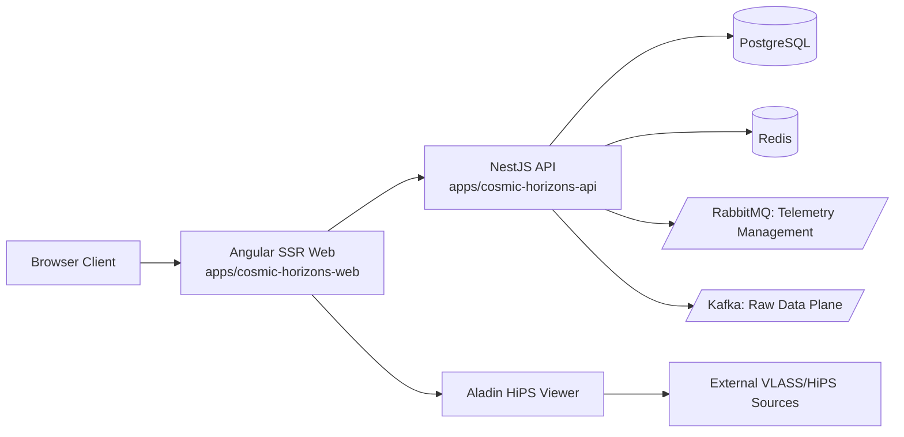

# Architecture (MVP)

Status date: 2026-02-07

Canonical scope is defined by:

- `documentation/product/PRODUCT-CHARTER.md`

- `SCOPE-LOCK.md`

Affiliation note:

- This architecture describes an independent project that consumes public VLASS data.

- It is not an official system owned or operated by VLA/NRAO.

**Related Documentation**:

- Target resolution & ephemeris architecture: [TARGET-RESOLUTION-EPHEMERIS.md](TARGET-RESOLUTION-EPHEMERIS.md)

- Scope decision (MVP vs. scientific): [EPHEMERIS-SCOPE-DECISION.md](EPHEMERIS-SCOPE-DECISION.md)

- Debugging guide for planet resolution: [MARS-RESOLUTION-DEBUGGING.md](MARS-RESOLUTION-DEBUGGING.md)

## Components

- Frontend: `apps/cosmic-horizons-web` (Angular SSR)

- Backend: `apps/cosmic-horizons-api` (NestJS + Postgres/Redis)

- Messaging Tier (Phase 3 v2.0): RabbitMQ (Telemetry Management) + Apache Kafka (Raw Data Stream).

- Remote Compute Gateway (Phase 4): `JobsModule` integration with TACC/CosmicAI exascale compute fabric.

- Shared models: `libs/shared/models`

## Remote Compute & AI Integration (Phase 4)

The Cosmic Horizon serves as the **AI Control Plane** for autonomous agents developed by the NSF-Simons CosmicAI initiative.

- **Frontend Job Console**: Enterprise-grade steering interface for monitoring AlphaCal and Radio Image Reconstruction performance.
- **Backend Orchestration**: `TaccIntegrationService` manages job submission, status polling, and result retrieval from TACC resources.
- **Explainability**: Integration of agent-generated Science Ready Data Products (SRDPs) into Aladin snapshots for auditable results.

Frontend runtime note:

- Mode A viewer includes short-lived client-side HiPS tile prefetch/cache (window-scoped, TTL/LRU bounded) for UX performance only.

## Boundaries

- Browser does not directly own policy decisions.

- NestJS enforces auth, RBAC, auditing, and rate limits.

- Viewer is Mode A only (Aladin) for MVP.

- SSR is the user entry path; API remains the policy and data control plane.

## Data Policy

- Public VLASS usage only.

- FITS is link-out only.

- No mirror-like proxy in MVP.

- Viewer tile prefetch is transient and non-mirroring (not persisted, bounded by policy).

## Rust and Go Decision

- Go microservice is removed from MVP.

- Rust rendering is optional and deferred.

- Because Mode B is deferred, no heavy rendering tier is required for MVP success.

- Re-introduce a render service only if one of these triggers occurs:

  1. Snapshot generation cannot meet quality/performance targets in Node/client path.

  2. SSR preview generation becomes CPU-bound in production.

  3. v2 Mode B is approved.

Mode B planning overview (timing, feasibility, permission assumptions):

## - `documentation/architecture/VIEWER-MODE-B-INTEGRATION-OVERVIEW.md`

---

*Cosmic Horizon Development - (c) 2026 Jeffrey Sanford. All rights reserved.*

---
*Independent portal using public VLASS data; not affiliated with VLA/NRAO.*
