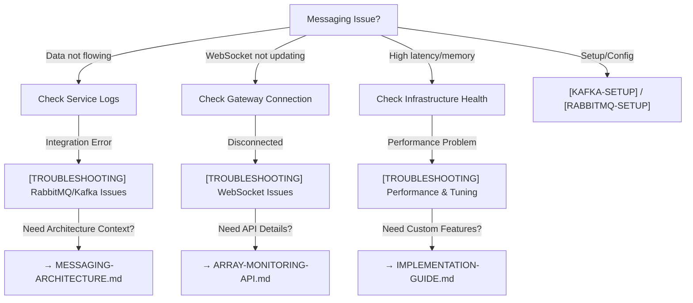

# Messaging System Documentation

**Welcome to the Cosmic Horizons Messaging System documentation**. This comprehensive guide covers the dual-layer (RabbitMQ + Kafka) infrastructure supporting real-time Array Information monitoring across distributed VLA elements.

## 📚 Documentation Overview

### For Quick Understanding

- **[MESSAGING-ARCHITECTURE.md](./MESSAGING-ARCHITECTURE.md)** — Start here! System design, components, data flow, and deployment targets

### For Infrastructure Setup

- **[KAFKA-SETUP.md](./KAFKA-SETUP.md)** — Kafka configuration, deployment (Docker & Kubernetes), performance tuning
- **[RABBITMQ-SETUP.md](./RABBITMQ-SETUP.md)** — RabbitMQ configuration, clustering, multi-node deployment

### For Integration & API Usage

- **[ARRAY-MONITORING-API.md](./ARRAY-MONITORING-API.md)** — REST endpoints, WebSocket events, frontend integration examples
- **[IMPLEMENTATION-GUIDE.md](./IMPLEMENTATION-GUIDE.md)** — Adding telemetry sources, custom metrics, analytics, NRAO feed integration

### For Operations & Configuration

- **[TROUBLESHOOTING.md](./TROUBLESHOOTING.md)** — Common issues, diagnostics, recovery procedures
- **[CONFIGURATION-FIX-GUIDE.md](./CONFIGURATION-FIX-GUIDE.md)** — Environment setup, Docker Compose configuration, infrastructure startup verification

---

## 🎯 Quick Start by Role

### Operator / DevOps

1. Read [MESSAGING-ARCHITECTURE.md](./MESSAGING-ARCHITECTURE.md) System Overview
2. Setup using [KAFKA-SETUP.md](./KAFKA-SETUP.md) + [RABBITMQ-SETUP.md](./RABBITMQ-SETUP.md)
3. Configure with [CONFIGURATION-FIX-GUIDE.md](./CONFIGURATION-FIX-GUIDE.md) for environment & Docker Compose fixes
4. Use [TROUBLESHOOTING.md](./TROUBLESHOOTING.md) for diagnostics

**Example Commands**:

```bash
# Verify infrastructure is healthy per CONFIGURATION-FIX-GUIDE.md
docker-compose ps

# Start API server
pnpm nx serve cosmic-horizons-api

# Get system statistics
curl http://localhost:3000/api/messaging/stats -H "Authorization: Bearer <token>"
```

### Backend Developer

1. Understand [MESSAGING-ARCHITECTURE.md](./MESSAGING-ARCHITECTURE.md) Architecture Components
2. Review [ARRAY-MONITORING-API.md](./ARRAY-MONITORING-API.md) Integration section
3. Follow [IMPLEMENTATION-GUIDE.md](./IMPLEMENTATION-GUIDE.md) for extensions

**Example: Add Custom Telemetry**

- See [IMPLEMENTATION-GUIDE.md § Adding Custom Metrics](./IMPLEMENTATION-GUIDE.md#adding-custom-metrics-to-telemetry)

### Frontend Developer

1. Study [ARRAY-MONITORING-API.md](./ARRAY-MONITORING-API.md) WebSocket section
2. Review React integration example
3. Use TypeScript types from `@cosmic-horizons/shared-models`

**Example: React Hook**

```typescript
// See ARRAY-MONITORING-API.md § Frontend Integration Example
const { stats, latestPacket, connected } = useMessagingStats();
```

---

## 🏗️ System Architecture at a Glance

```text
┌─ Array Elements (60 total, 5 sites)
│
├─ MessagingService (Simulation / NRAO Feed)
│  └─ Subject<TelemetryPacket>
│
├─ MessagingIntegrationService (Dual Emit)
│  ├─ RabbitMQ (Management Plane) — Orchestration
│  └─ Kafka (Data Plane) — Visibility Archive
│
├─ MessagingMonitorService (Health Polling)
│  • Kafka Admin API
│  • RabbitMQ HTTP API
│  • PostgreSQL connectivity
│  • Redis connectivity
│
├─ MessagingStatsService (Aggregation)
│  • Per-second throughput
│  • Infrastructure snapshot
│
├─ MessagingGateway (WebSocket Broadcast)
│  └─ telemetry_update + stats_update events
│
└─ Frontend (Array Information Monitoring UI)
```

Detailed diagram: [MESSAGING-ARCHITECTURE.md § System Overview](./MESSAGING-ARCHITECTURE.md#system-overview)

---

## 📊 Key Metrics

| Metric | Value | Reference |
|--------|-------|-----------|
| Telemetry Rate | ~600 packets/sec | 60 elements × 10 Hz |
| Packet Size | 200-500 bytes | TelemetryPacket structure |
| RabbitMQ Queue | element_telemetry_queue | Non-durable (mgmt plane) |
| Kafka Topic | element.raw_data | Replicated (data plane) |
| Monitor Poll | Every 2 seconds | Configurable in service |
| WebSocket Broadcast | Every 1 second (stats) | Real-time (telemetry) |
| Storage Backends | PostgreSQL + Redis | Audit + cache layer |

---

## 🔧 Configuration

### Environment Variables

```bash
# RabbitMQ
RABBITMQ_HOST=rabbitmq              # Broker hostname
RABBITMQ_PORT=5672                  # AMQP port
RABBITMQ_MANAGEMENT_PORT=15672      # HTTP API
RABBITMQ_USER=guest
RABBITMQ_PASS=guest

# Kafka
KAFKA_HOST=kafka                     # Broker hostname
KAFKA_PORT=9092                      # PLAINTEXT port

# Storage
DB_HOST=localhost
DB_PORT=15432
DB_USER=cosmic_horizons_user
DB_PASSWORD=***
DB_NAME=cosmic_horizons

REDIS_HOST=localhost
REDIS_PORT=6379
```

Full reference: `documentation/reference/ENV-REFERENCE.md`

---

## 🚀 Deployment

### Local Development

```bash
docker-compose up -d rabbitmq kafka zookeeper postgres redis
export NODE_ENV=development
pnpm nx serve cosmic-horizons-api
```

### Docker Compose Stack

- RabbitMQ (3+ replicas for HA)
- Kafka Cluster (3 brokers + Zookeeper)
- PostgreSQL
- Redis

See: `docker-compose.yml` at repository root

### Production (Kubernetes)

- **RabbitMQ**: 3-node HA cluster with StatefulSet
- **Kafka**: 3+ broker cluster with Zookeeper ensemble
- **Storage**: Managed database services

See: [KAFKA-SETUP.md § Production Setup](./KAFKA-SETUP.md#production-setup-kubernetstacc) and [RABBITMQ-SETUP.md § Production Setup](./RABBITMQ-SETUP.md#production-setup-kubernetstacc)

---

## 🎓 Use Cases

### Real-Time Monitoring Dashboard

Display live array element status, power consumption, RFI events

- **API**: `GET /api/messaging/stats` (1s polling) + WebSocket `stats_update`
- **Guide**: [ARRAY-MONITORING-API.md](./ARRAY-MONITORING-API.md)

### Health Alerts & Anomaly Detection

Detect RFI episodes, power anomalies, vibration spikes

- **Implementation**: Custom analytics service in [IMPLEMENTATION-GUIDE.md](./IMPLEMENTATION-GUIDE.md#adding-aggregation--analytics)

### Multi-Site Array Orchestration

Route commands from Socorro hub to remote relay sites via RabbitMQ

- **Pattern**: hub_to_hub messages in TelemetryPacket.routeType

### Long-Term Data Archive

Store 7+ days of visibility data in Kafka with retention policies

- **Configuration**: [KAFKA-SETUP.md § Topic Configuration](./KAFKA-SETUP.md#topic-elementraw_data)

---

## 🔍 Diagnostics Commands

```bash
# Check all services are healthy
docker-compose ps

# RabbitMQ diagnostics
curl http://localhost:15672/api/connections -u guest:guest

# Kafka topic info
docker-compose exec kafka kafka-topics.sh \
  --describe --topic element.raw_data --bootstrap-server localhost:9092

# View live telemetry stream
curl http://localhost:3000/api/messaging/elements \
  -H "Authorization: Bearer <token>" | jq '.[] | select(.status != "operational")'

# Monitor throughput
watch -n 1 "curl -s http://localhost:3000/api/messaging/stats \
  -H 'Authorization: Bearer <token>' | jq '.packetsPerSecond'"
```

---

## 📋 Troubleshooting Flowchart



---

## 📖 Documentation Map

```text
documentation/backend/messaging/
├── README.md (this file)
├── MESSAGING-ARCHITECTURE.md         ← Start here
├── ARRAY-MONITORING-API.md           ← REST + WebSocket endpoints
├── KAFKA-SETUP.md                    ← Data plane deployment
├── RABBITMQ-SETUP.md                 ← Management plane deployment
├── CONFIGURATION-FIX-GUIDE.md        ← Environment setup fixes
├── IMPLEMENTATION-GUIDE.md           ← Add features
├── TROUBLESHOOTING.md                ← Debug issues
└── LIVE-STATISTICS-FEB-2026.md       ← System baseline metrics
```

---

## 📞 Related Documentation

Within Cosmic Horizons Repository:

- **Backend API**: `documentation/backend/API-ROUTES.md` — All API endpoints
- **Logging**: `documentation/backend/LOGGING-SYSTEM-DESIGN.md` — Audit trail integration
- **Rate Limiting**: `documentation/backend/RATE-LIMITING.md` — Messaging API quotas
- **Architecture**: `documentation/architecture/ARCHITECTURE.md` — System-wide design
- **Testing**: `documentation/guides/TESTING_GUIDE.md` — Unit & E2E test patterns
- **Environment**: `documentation/reference/ENV-REFERENCE.md` — Configuration reference

---

## 🤝 Contributing

To extend the messaging system:

1. **Plan your change** — Is it a new source? Custom metric? Analytics feature?
2. **Review** [IMPLEMENTATION-GUIDE.md](./IMPLEMENTATION-GUIDE.md) for patterns
3. **Write tests** — See Testing section in guide
4. **Document changes** — Update this index if adding new concepts
5. **Submit PR** — Include tests + documentation updates

---

## 📜 License

This documentation is part of Cosmic Horizons. See LICENSE at repository root.

**Disclaimer**: Cosmic Horizons is not affiliated with VLA/NRAO and operates as an independent research portal.

---

## Version & Status

| Component | Version | Status | Last Updated |
|-----------|---------|--------|--------------|
| Architecture | 1.0 | Stable | 2026-02-13 |
| RabbitMQ Setup | 1.0 | Production-ready | 2026-02-13 |
| Kafka Setup | 1.0 | Production-ready | 2026-02-13 |
| API Reference | 1.0 | Stable | 2026-02-13 |
| Implementation Guide | 1.0 | Stable | 2026-02-13 |
| Troubleshooting | 1.0 | Comprehensive | 2026-02-13 |

---

**Last Updated** February 13, 2026  
**Maintainers**: Cosmic Horizons Backend Team  
**Questions?** See TROUBLESHOOTING.md or open an issue
