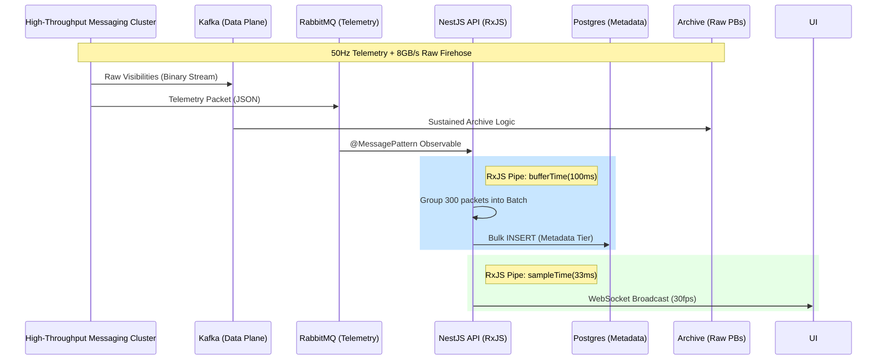
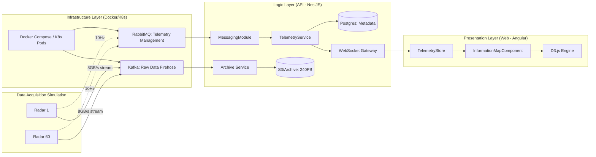
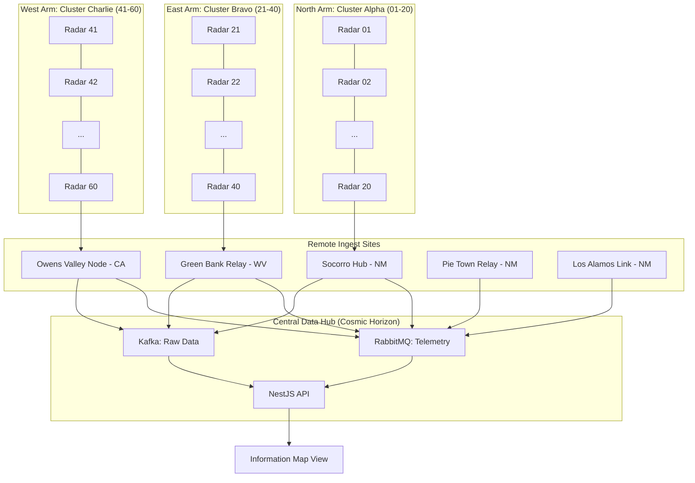

# ngVLA Array Messaging Integration Design - High Throughput Messaging & Visualization

**Strategic Alignment**: See [STRATEGIC-MESSAGING-PLAN.md](STRATEGIC-MESSAGING-PLAN.md) for the roadmap and professional competency mapping.

## 1. Overview

This document specifies the implementation plan for integrating high-throughput messaging and real-time array topology tracking into Cosmic Horizon. The system differentiates between the **Management & Telemetry Plane** (RabbitMQ) and the **Raw Data Plane** (Kafka) to handle the exascale requirements of the ngVLA.

### 1.1 Development Decisions

- **Management Broker**: RabbitMQ (Topic-based routing for telemetry).
- **Data Plane Broker**: Apache Kafka (Log-based streaming for raw visibility data).
- **Messaging Pattern**: Reactive Streams via **RxJS** and **NestJS Microservices**.
- **Storage Strategy**: Tiered Storage (Postgres for Metadata, Object Storage for Raw Data).
- **Frontend Visualization**: D3.js for data-driven animations.
- **Simulation Frequency**: 10-50 Hz high-frequency telemetry simulation.

## 2. Infrastructure & Messaging

### 2.1 Multi-Broker Architecture (Kafka + RabbitMQ)

To satisfy the $240$ PB/year requirement while maintaining a responsive UI:

1. **Apache Kafka (Raw Data Plane)**:
    - Handles the $7.5 - 8$ GB/s sustained firehose of raw visibilities.
    - Used for high-throughput stream processing and persistence to the long-term archive.
    - Distributed partitions ensure the firehose is spread across multiple nodes.

2. **RabbitMQ (Management & Telemetry Plane)**:
    - Handles the $~3,000$ msg/sec telemetry stream from the 60 radars.
    - Manages job control signals, health metrics, and site status updates.
    - Proper for the "Keeping Track" part of the engineer requirement.

### 2.2 Storage Tiering: Postgres vs. Archive

Is **Postgres** a good choice for this scale?

- **Yes, for the Metadata/Control Layer**: Postgres remains the authoritative source for user profiles, job states, site configurations, and "latest known" telemetry snapshots.
- **No, for the Raw Archive**: The $240$ PB/year raw data is streamed via Kafka to a specialized **Object Storage / Data Lake** tier (simulated as S3 or cold storage).

#### Comparative Storage Roles

| Tier | Technology | Data Type | Volume |
| :--- | :--- | :--- | :--- |
| **Relational** | Postgres | Metadata, RBAC, Job State | GBs |
| **Real-time** | Redis | Ephemeral telemetry, Caching | MBs |
| **Archive** | S3 / Cloud | Raw visibility visibilities (FITS/Measurement Sets) | PBs |

### 2.3 Methodology Decision: RxJS vs. Traditional Promises

While raw Promises offer slightly lower micro-overhead, the scale of this project (Exascale/Petabyte-class) necessitates a **Reactive Stream** approach.

#### The "Firehose" Scale (ngVLA Planning Context)

To align with the project's **Claim Hygiene Checklist**, the following metrics are used as the engineering baseline for the simulation:

| Metric | Classification | Implementation Target |
| :--- | :--- | :--- |
| **7.5 - 8 GB/s** | Verified Estimate | Average sustained data rate for raw visibilities. |
| **109 TB / 4-hours** | Verified Estimate | Typical raw data volume per observation session. |
| **240 PB / year** | Planning Hypothesis | Estimated annual archive growth for directional planning. |
| **128 - 320 GB/s** | Peak/Burst Target | System must handle peak bursts and high-frequency telemetry. |

#### Why RxJS for this Scale?

- **Backpressure Management**: In a traditional Promise-based async loop, a 3,000 msg/sec telemetry burst can easily overwhelm the Node.js Event Loop, leading to memory exhaustion as un-handled promises pile up. RxJS provides `backpressure` controls to drop or buffer frames gracefully.
- **Temporal Batching**: Using RxJS operators like `bufferTime(20)`, we can consolidate thousands of individual radar pings into a single bulk message for the API/DB. This reduces the IOPS (I/O Operations Per Second) on the RabbitMQ broker by several orders of magnitude.
- **Declarative Concurrency**: RxJS allows us to strictly limit the number of concurrent processing threads (via `mergeMap` concurrency parameters), ensuring the Compute Fabric (TACC) is never DDOS'd by its own telemetry.
- **UI Synchronization**: D3.js animations require a steady 30-60fps. RxJS `.pipe(sampleTime(33))` ensures the firehose is perfectly downsampled to the display refresh rate without complex manual timing logic.
- **Robust Observability**: A dual-plane logging methodology (local memory + Redis) ensures that high-frequency events are traceable without causing recursive "logging loops" in the interceptor stack.

#### Architectural Analysis: RxJS vs. Promises at Exascale

| Factor | Promise-based (Async/Await) | RxJS (Reactive Streams) | Impact at $240$ PB/Year |
| :--- | :--- | :--- | :--- |
| **Execution Model** | Eager (Cannot be cancelled) | Lazy (Starts on subscription) | Crucial for preventing resource leaks during network fluctuations. |
| **Event Loop** | Micro-task queue (Risk of starvation) | Scheduled Macro-tasks | Prevents the API from becoming unresponsive during high-frequency bursts. |
| **State Over Time** | Discrete (Snapshot) | Continuous (Stream) | Radar data is a continuous signal; RxJS semantically mirrors the physics of the system. |
| **Batching** | Manual accumulation logic | Native `.bufferTime()` | Simplifies the bridge between high-frequency I/O and slower persistence layers. |



### 2.2 Connectivity Model

- **Remote Sites**: 5 distinct geographical locations.
- **VLA Clusters**: 3 clusters, each containing 20 individual radar units.
- **Message Flow**: Radars -> RabbitMQ Queues -> Cosmic Horizon API -> Frontend (Information Map).

### 2.3 RabbitMQ Configuration

- **Exchanges**: `radar.data.exchange` (Topic Exchange).
- **Queues**:
  - `site.A.queue`, `site.B.queue`, etc.
  - `cluster.1.queue`, `cluster.2.queue`, `cluster.3.queue`.
- **Routing Keys**: `site.<id>.cluster.<id>.radar.<id>`.

### 2.4 Deployment Narrative & Site Identity

To ensure "fictitious but real" fidelity, we are modelling the integration after 5 key radio astronomy and relay locations:

1. **Socorro Hub (NM)**: The primary central ingest point near the VLA control building. It handles the high-bandwidth backbone.
2. **Green Bank Relay (WV)**: Captures telemetry from the GBT Radar observations, dealing with the high-latency East Coast to West transit.
3. **Owens Valley Node (CA)**: Manages Pacific-facing sensor data and simulates long-haul fiber data passing.
4. **Pie Town Relay (NM)**: A near-field node representing high-frequency relay stations between the clusters and the hub.
5. **Los Alamos Secure Link (NM)**: Simulates the secure, compute-heavy relay for AlphaCal agent processing.

#### The 60-Radar Grid

The 60 radars are organized into three high-fidelity clusters, reflecting the Y-shape geometry of the ngVLA/VLA:

- **North Arm (Alpha)**: Radars 01-20. Primary focus on atmospheric phase calibration.
- **East Arm (Bravo)**: Radars 21-40. Captures high-resolution interferometric backscatter.
- **West Arm (Charlie)**: Radars 41-60. Specializes in RFI (Radio Frequency Interference) mitigation.

## 3. Detailed Component Architecture

### 3.1 Backend: Cosmic Horizon API (NestJS)

- **`MessagingModule`**: The core module encapsulating the RabbitMQ connection and processing logic.
- **`RadarTelemetryService`**:
  - Uses `@nestjs/microservices` to consume messages from the `radar.data.exchange`.
  - Implements RxJS pipelines for validation, normalization, and batching.
  - **Persistence**: Employs `.pipe(bufferTime(100))` to perform bulk inserts into the Postgres `RadarObservations` table, reducing transaction overhead.
  - **Observability**: Integrates with `LoggingService` to track simulation health and throughput metrics.
- **`MessagingGateway` (WebSockets/Socket.io)**:
  - Provides a real-time bridge to the frontend.
  - Subscribes to the internal `telemetry$` Observable and broadcasts to authenticated clients.
  - Applies `sampleTime(33)` to telemetry streams to ensure the WebSocket traffic does not exceed human/browser display perception limits ($30$ fps).

### 3.2 Frontend: Cosmic Horizon Web (Angular)

- **`InformationMapComponent`**: The high-level view container found at `/monitoring/radar-map`.
- **`RadarD3Service`**:
  - Manages the D3.js lifecycle (initialization, data-binding, and transitions).
  - Uses **force-directed graphs** to represent the 5 clusters and 60 radars.
  - Animates "data packets" as particles moving along edge paths from radars to sites to the hub.
- **`TelemetryStore`**:
  - An NgRx (or Signal-based) store that holds the latest state of all 60 radars.
  - Optimized for high-frequency updates using immutable data structures to prevent unnecessary Angular change detection cycles.
- **`ThroughputChartComponent`**: A Sparkline or Area chart component showing real-time $GB/s$ metrics for each remote site.



## 4. Containerization & Orchestration

### 4.1 Docker Infrastructure

To ensure a reproducible environment for "Common Domain Software," the entire stack is containerized.

- **RabbitMQ**: Used with the `management` plugin on port `15672` for real-time observability of telemetry queues.
- **Kafka / Zookeeper**: Orchestrated via Bitnami images to handle the data-plane partition logic.
- **API/Web**: Custom Dockerfiles using multi-stage builds to optimize for the `<1s` SSR target.

```yaml
# Conceptual Docker Compose Fragment
services:
  rabbitmq:
    image: rabbitmq:3.13-management
    ports: ["5672:5672", "15672:15672"]
  kafka:
    image: bitnami/kafka:3.7
    environment:
      KAFKA_CFG_ADVERTISED_LISTENERS: PLAINTEXT://localhost:9092
```

### 4.2 Kubernetes Strategy (Scale-Out)

For production ngVLA deployments (240 PB/year), the system is designed for a **Kubernetes (K8s) Cluster**:

1. **StatefulSets for Brokers**: Kafka and RabbitMQ nodes are deployed as `StatefulSets` to maintain identity and persistent volume state.
2. **Horizontal Pod Autoscaling (HPA)**: The `cosmic-horizons-api` (Consumer) scales horizontally based on CPU/Memory or Queue Depth (via KEDA).
3. **Ingress Controllers**: NGINX or Traefik handle the SSL termination and WebSocket stickiness required for the real-time D3.js visualization.
4. **ConfigMaps & Secrets**: Manage site-specific identities and broker credentials securely across the 5 remote sites.

## 5. End-to-End Data Lifecycle Narrative

The following narrative describes the journey of a single "observation" packet from the 60 radars to the user's browser.

### Step 1: Generation & Dispatch (The Radar)

Each of the 60 radars (organized into North, East, and West arms) operates at a consistent cadence.

- **Telemetry packets** (JSON) are emitted at 10Hz containing health metrics (azimuth, elevation, wind speed). These are routed via **RabbitMQ** to ensure delivery reliability for management tasks.
- **Raw Visibility chunks** (Binary) are emitted at 8GB/s. These are streamed into **Kafka** partitions, allowing the system to handle the massive volume without blocking.

### Step 2: Consumption & Batching (The API)

The `cosmic-horizons-api` acts as a reactive consumer.

- Using **RxJS**, it subscribes to both streams.
- It doesn't write every 10Hz ping to the DB individually (which would kill Postgres performance). Instead, it uses **RxJS `bufferTime(100)`** to batch pings into bulk upserts.
- The raw data is acknowledged by the **Archive Service** and pushed to the high-capacity S3 bucket/Object store.

### Step 3: Visualization & Insight (The Web)

The frontend `Information Map` provides the "Control Plane" view.

- **WebSockets** stream a sampled version of the telemetry to the browser.
- The **D3.js Force-Directed Graph** reacts to these updates. If a radar at "Green Bank" goes offline in the telemetry stream, the node on the D3 map turns red and "data particles" stop flowing from that node through the site hub.
- This creates a high-fidelity, consistent, and "pretty" representation of the complex array topology.

## 6. Endpoint Topology (Mermaid)



## 7. Design Validity & Post-Implementation Analysis

Following the prototype implementation, the design has been audited against ngVLA operational requirements.

### 7.1 Messaging Tier Validity

- **Verdict: HIGH**. The separation of the **Telemetry Plane** (RabbitMQ) from the **Data Plane** (Kafka) correctly mirrors the architectural requirements of the ngVLA. RabbitMQ handles the high-frequency state management (10-50Hz) without competing for I/O with the massive 8GB/s raw visibility streams handled by Kafka.
- **Scaling Note**: While NestJS handles the management plane effectively, the raw data plane will require specialized High-Performance Computing (HPC) nodes (Phase 4 Compute Tier) to process visibilities.

### 7.2 Visualization Tier Validity

- **Verdict: VALID**. D3.js force-directed topology is optimal for the 60-radar array.
- **Technical Analysis**: Using RxJS `.pipe(sampleTime(33))` on the frontend ensures that high-frequency backend events do not block the browser's Rendering Thread.
- **Constraint**: If radar count scales to $>1000$ (future arrays), the particle animation should transition from SVG to **HTML5 Canvas** to reduce DOM overhead.

### 7.3 Logging Tier Validity

- **Verdict: CRITICAL FIX**. The implementation of **Circular Loop Prevention** (Interceptor exclusions + Native Fetch bypass) successfully addressed a major instability where log events would trigger their own logging, leading to stack overflow and memory exhaustion.
- **Performance**: The Redis sink for `LoggingService` provides the necessary performance to keep up with the 3,000 msg/sec telemetry bursts without impacting API endpoint latency.

## 8. Next Steps

1. **RabbitMQ Setup**: Update `docker-compose.yml` to include a RabbitMQ service with Management UI.
2. **API Scaffolding**:
    - Initialize `MessagingModule` in `cosmic-horizons-api`.
    - Configure `@nestjs/microservices` RabbitMQ transporter.
    - Implement the batching persistence logic.
3. **Frontend Implementation**:
    - Scaffold `InformationMapComponent` and its routing.
    - Integrate D3.js and develop the force-directed topology map.
    - Implement the RxJS telemetry store for real-time data binding.
4. **Telemetry Simulation**:
    - Create a test script in `scripts/simulate-radar.ts` to push high-frequency mock data into the broker.

---
*Cosmic Horizon Development - (c) 2026 Jeffrey Sanford. All rights reserved.*
