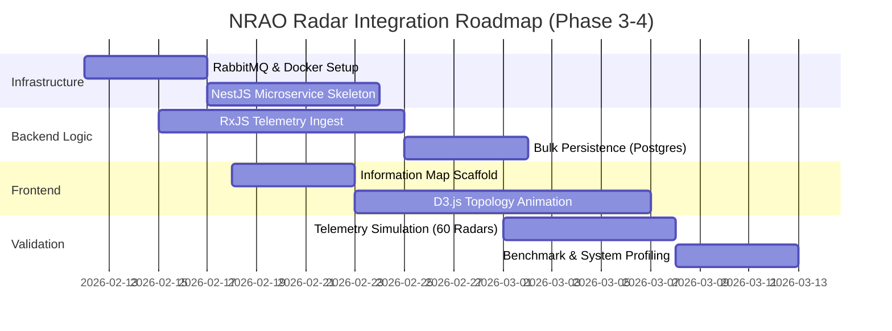

# ngVLA Array Messaging Integration Strategy

## 1. Objective

This document outlines the strategic integration of competencies required for the ngVLA Software Engineer role into the **Cosmic Horizon** project. The goal is to evolve the platform into a "Common Domain Software" prototype capable of handling high-throughput messaging, multi-site data passing, and specialized array topology visualization.

**Technical Implementation Details**: See [ARRAY-MESSAGING-DESIGN.md](ARRAY-MESSAGING-DESIGN.md) for architecture, messaging patterns, and site topology.

## 2. Phased Integration Roadmap

## 3. Targeted NRAO Competencies

| Competency | Cosmic Horizon Implementation Target | Priority |
| :--- | :--- | :--- |
| **Messaging Frameworks** (Kafka, RabbitMQ, Pulsar) | Implementation of a **Message Bus** for Job Orchestration (notifying the Portal of TACC/ngVLA job progress). | High |
| **Site-to-Site Data Passing** | Benchmarking suite for visibility data movement between theoretical ngVLA remote sites. | Medium |
| **Radar Data Visualization** | Integration of Radar-specific viewers (Range-Doppler maps) into the Aladin-centric UI. | High |
| **System Profiling** | Instrumenting the `cosmic-horizons-api` to measure message latency and data-bus throughput. | Medium |
| **Agile/Scrum Discipline** | Maintain 2-week sprints with documented ADRs and Test-Driven Development (TDD). | Operational |

## 3. Pillar 3: CosmicAI & Radar Synergy

The NRAO Radar project and ngVLA represent the "Next Generation" of data challenges. Cosmic Horizon will serve as the **AI Control Plane** for these systems.

### 3.1 Messaging-Driven Architecture

- **Concept**: Move from polling-based API requests to an Event-Driven Architecture (EDA) with dual-plane separation.
- **Tooling**: Introduction of NestJS `Microservices` module using **RabbitMQ** (Telemetry/Control) and **Kafka** (Raw Data) as message brokers.
- **Infrastructure**: Containerized development via **Docker Compose** and production-ready **Kubernetes** orchestration patterns.
- **Goal**: Demonstrate proficiency in asynchronous system communication and exascale data management.

### 3.2 Radar Shared Data Backend

- **Concept**: A "Common System" backend that provides uniform access to both interferometric (visibilities) and radar (backscatter) data.
- **Workflow**: Create a `RadarService` in `cosmic-horizons-api` that simulates the retrieval of data from GBT Radar or the planetary radar systems.

### 3.3 Site-to-Site Benchmarking

- **Concept**: Virtualized "Sites" (VLA, GBT, Owens Valley, etc.) with simulated bandwidth constraints.
- **Workflow**: A specialized CLI tool within `scripts/` to profile data movement between these nodes, measuring p95 latencies for 100TB+ simulated datasets.

## 4. Implementation Roadmap (Phase 3 Integration)

1. **Radar Visualization Spike**: Update the frontend to handle non-FITS radar data products.
2. **Message Bus Infrastructure**: Scaffold a local RabbitMQ instance via `docker-compose.yml` for real-time telemetry.
3. **Profiling Dashboard**: Add a "System Health" tab to the Admin Dashboard showing site-to-site data transit metrics.

## 5. Strategic Alignment

This integration ensures that Cosmic Horizon is not just a portal, but a **Common System Software** testbed, directly addressing the requirements for the NRAO Radar/ngVLA engineering pipeline.
