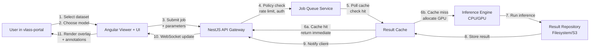

# Phase 2: AI Integration Foundation

**Status date:** 2026-02-10  
**Status:** PLANNING  
**Strategic Alignment:** NSF-Simons CosmicAI Institute, ngVLA preparation

---

## Overview

Phase 2 transforms vlass-portal from a **static data browser** into an **AI-driven scientific operations platform**. The MVP established the UI/UX layer and community collaboration model. Phase 2 adds the inference orchestration, algorithm integration, and reproducibility tracking that makes the platform indispensable for AI-assisted radio astronomy.

**Strategic context:**  
CosmicAI is producing state-of-the-art algorithms for radio image reconstruction, calibration anomaly detection, hyperspectral analysis, and interferometric processing. NSF NRAO presented these at the 247th AAS meeting. Phase 2 makes vlass-portal the control plane for these algorithms—providing workflow orchestration, UI, policy enforcement, and auditability that the research community lacks.

**Success definition:**  
Users can submit VLASS data to AI analysis workflows, monitor results, reproduce experiments, and publish findings—all without leaving vlass-portal.

---

## Four Core Pillars

### Pillar 1: Inference Service Layer

**Goal:** Integrate production-grade ML models as first-class services in vlass-portal.

**Scope:**

- Build inference orchestration service in NestJS backend
  - Job submission API with request queuing and lifecycle tracking
  - Model registry: version control, GPU memory requirements, compute costs
  - Result storage: JSON + artifact (images, HDF5, parquet files)
  - Status streaming: WebSocket updates as jobs progress

- Model integration targets (prioritized):
  1. **Calibration Anomaly Detection** (Eric Murphy, NSF NRAO) — most stable for deployment
  2. **AlphaCal** (autonomous interferometric calibration) — productionizable
  3. **Hyperspectral Event Detection** (transfer learning pipeline) — mid-stability
  4. **Radio Image Reconstruction** (Omkar Bait) — research-adjacent, optional for v2.1

- Data flow:

  ```text
  User selects dataset in viewer
     ↓
  Chooses analysis model + parameters
     ↓
  Frontend submits inference request (authenticated, rate-limited)
     ↓
  Backend queues job, allocates resources
     ↓
  Model inference (GPU or CPU)
     ↓
  Results returned to viewer as overlay/annotation
     ↓
  User can save result as post/snapshot
  ```

**Integration points:**

- Aladin viewer: render anomaly regions as HiPS overlays (red/yellow highlights)
- Post editor: embed inference results inline ("This region triggered anomaly detection v2.3")
- RBAC: different role access levels (user = read results, power user = run custom params, admin = model deployment)

**Success metrics:**

- Calibration anomaly API latency <10s for typical VLASS cutout
- ≥80% inference success rate (retryable failures)
- Model versioning prevents silent drift (all results tag exact model/params)

**Not included:**

- GPU resource provisioning (defer to Phase 3: TACC integration)
- Custom model training pipeline
- Real-time streaming inference (batch-only)

---

### Pillar 2: GPU Job Orchestration

**Goal:** Transform vlass-portal into a reliable job submission and monitoring interface.

**Scope:**

- Job queue manager (local or Kubernetes-ready)
  - Priority tiers: interactive (<1 min), batch (<10 min), long-running (>10 min)
  - Retry logic: exponential backoff for transient GPU failures
  - Resource negotiation: request GPU type, memory, timeout

- Job monitoring UI
  - Job status page: submitted → queued → running → complete/error
  - Progress visualization: time elapsed, remaining estimate, resource usage
  - Error replay: re-submit with diagnostic logs
  - Audit trail: who ran what, when, with which parameters

- Caching layer
  - Store inference results keyed by (dataset_id, model_version, parameters)
  - Return cached results for identical requests (with freshness indicator)
  - Reduce duplicate compute, speed up responsive UX

**Integration points:**

- Dashboard: widget showing running jobs (count, ETA, next free slot)
- Post editor: link to job artifacts ("Results from job-2026-02-10-xyz")
- API: WebSocket for live status updates (reduces polling)

**Success metrics:**

- Queue depth <5 seconds for typical submissions
- 99.5% job completion rate (user-recoverable retries)
- 50%+ cache hit rate on re-analysis

---

### Pillar 3: Reproducibility Framework

**Goal:** Make all analyses reproducible: dataset → model → parameters → output.

**Scope:**

- Analysis graph: DAG linking inputs to outputs
  - Each job stores: input URI, model ID, model version, full parameter JSON, output artifact
  - Users can trace how a result was generated
  - Publish analysis as "recipe" — others can fork/replay with different data

- Experiment versioning
  - Tag experiments: "My calibration study v1.0"
  - Store immutable analysis state snapshot
  - Pin input dataset versions + model versions
  - Enable "what changed?" diffs between experiment versions

- Reproducibility API
  - `GET /experiment/{id}/graph` → returns full lineage as JSON
  - `POST /experiment/{id}/fork?dataset=xyz` → replay on new data
  - `POST /experiment/{id}/publish` → makes it discoverable in community

**UI:**

- Post editor: "Reproduce this analysis" button → auto-fills model + params
- Profile: user's experiments tab + reproducibility score (how many users replayed their work?)

**Success metrics:**

- 100% of inference results are reproducible (linkage data complete)
- ≥30% of published posts include reproducible analysis

---

### Pillar 4: Explainability UI (Detection + Attribution)

**Goal:** Surface why models made decisions—why was this region flagged as anomalous?

**Scope:**

- Model output interpretation layer
  - Calibration detection: show which antenna/baseline triggered alert
  - Anomaly heat maps: overlay saliency visualization on viewer
  - Spectral analysis: annotate significant transitions (from Ce-Ci Xue's work)

- Attribution UI
  - Hover over flagged region → see contributing features
  - "Why did the model flag this?" → top 3 influencing factors
  - Confidence score + uncertainty bounds

- Trustworthiness annotations
  - Tag inference results with domain expert confidence ("high", "moderate", "low")
  - Collect user feedback: "correct detection", "false positive", "missed something"
  - Surface consensus to help users weight results

**Integration points:**

- Viewer: right-click flagged region → see explanation panel
- Post editor: cite explainability data in markdown
- Dashboard: aggregate false positive rate per model version

**Success metrics:**

- Users rate 80%+ of explanations as "helpful or better"
- <5% of published results mischaracterize inference explainability

---

## Technical Architecture



**Backend services:**

- InferenceOrchestrator: job submission, queueing, status tracking
- ModelRegistry: version control, deployment manifesto, resource declarations
- ResultCache: query by (dataset, model, params) hash
- ExplainabilityEngine: attribute model decisions → UI annotations
- ReproducibilityGraph: DAG storage + replay orchestration

**Frontend:**

- JobMonitor component: real-time job status sidebar
- InferenceResult component: overlay renderer for anomaly detection
- ExplanationPanel: collapsible detail view on user hover
- AnalysisGraphView: visualization of experiment lineage

---

## Integration with Existing MVP

| MVP Component | Phase 2 Integration |
| --- | --- |
| Aladin Viewer (Mode A) | Results render as HiPS overlays; model outputs become new layers |
| ViewerState | Extended to include `inferenceResults`: array of model outputs at this view |
| Snapshots | Include inference overlays in PNG export; link snapshot to job artifact |
| Posts | Embed job results inline; cite reproducibility recipe |
| RBAC | Model access gated by user role (basic/power/admin) |
| Audit Logging | All submissions, results, explainability queries logged |

---

## Dependencies & Timeline

**Hard dependency:**

- CosmicAI models must be containerized + API-serializable (image reconstruction already is; calibration detection in progress)

**Timeline:**

- Weeks 1–2: Job orchestration service + basic model integration
- Weeks 3–4: Viewer overlay rendering + result streaming
- Weeks 5–6: Caching + reproducibility graph
- Weeks 7–8: Explainability UI + community feedback cycle

**Effort:** ~12–16 weeks (full stack engineering)

---

## Out of Scope (Phase 3)

- TACC integration (resource provisioning, remote GPU scheduling)
- Real-time streaming inference
- Custom model fine-tuning or training workflows
- Distributed job scheduling across multiple sites
- Advanced resource quotas or multi-tenancy (simple RBAC only)

---

## Success Criteria

1. **Technical:**
   - Inference service latency <10s for typical calibration check
   - 99%+ job completion rate
   - Full reproducibility linkage on 100% of results

2. **User-facing:**
   - 10+ published posts containing inference results
   - 3+ users running reproducibility forks
   - 80%+ confidence in explanation UI

3. **Strategic:**
   - Can credibly claim "AI-driven" in funding applications
   - Demonstrates readiness for TACC partnership (Phase 3)

---

## Related Documents

- [../roadmap/ROADMAP.md](../roadmap/ROADMAP.md) — overall project timeline
- [../../architecture/ARCHITECTURE.md](../../architecture/ARCHITECTURE.md) — MVP infrastructure
- [../../backend/RBAC-ROLES.md](../../backend/RBAC-ROLES.md) — access control model (extend for model permissions)
- [../../product/PRODUCT-CHARTER.md](../../product/PRODUCT-CHARTER.md) — MVP scope (Phase 2 builds on this)
- [../funding/FUNDING-AND-COSTS.md](../funding/FUNDING-AND-COSTS.md) — Funding strategy and cost breakdown
