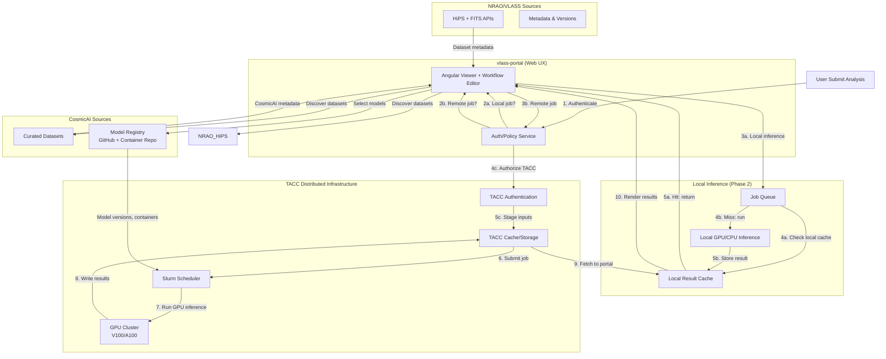

# Phase 3: CosmicAI Federation & ngVLA Preparation

**Status date:** 2026-02-10  
**Status:** PLANNING  
**Strategic Alignment:** NSF-Simons CosmicAI Institute, ngVLA (244 antennas, 50 petaFLOPS), TACC partnership

---

## Overview

Phase 3 establishes vlass-portal as the **scientific operations platform** for CosmicAI's computational ecosystem. While Phase 2 integrated local inference, Phase 3 docks into CosmicAI's distributed infrastructure at TACC, federates multi-site datasets, and prepares the system for ngVLA's 50-petaflop data challenge.

**Strategic context:**  
CosmicAI is building an open-source platform at TACC with compute fabric, data lake, and ML tooling. They lack operational UI, governance, and workflow orchestration—exactly what vlass-portal provides. This phase makes vlass-portal the "control plane" for CosmicAI, aligning with NSF and DOE infrastructure funding models.

**Success definition:**  
Researchers can discover and analyze datasets from VLASS, NRAO archives, and CosmicAI curations; submit workflows to TACC GPU clusters; track reproducibility across institutional boundaries; and publish peer-reviewed analysis notebooks—all from vlass-portal.

---

## Four Core Pillars

### Pillar 1: Dataset Federation

**Goal:** Unified discovery and access across NRAO, CosmicAI, and ngVLA data sources.

**Scope:**

- Federated dataset registry
  - Authentication to multiple sources (NRAO auth, TACC auth, institutional SSO)
  - Dataset metadata sync: URI, provenance, access tier, ingestion date
  - Query aggregation: "Show all VLASS + CosmicAI-curated datasets in RA/Dec region"
  - Rate limiting and quota management per source

- Data APIs for each source:
  - NRAO: existing VLASS HiPS, FITS endpoints (integrate via proxy)
  - TACC: S3 buckets with dataset manifests, POSIX mounting for large files
  - CosmicAI curations: versioned dataset packages (JupyterHub-ready)

- Data lineage tracking
  - Track dataset origins: "This CosmicAI training set was sampled from VLASS v3.2 Dec 2025"
  - Versioning: datasets evolve (new calibrations, corrections)
  - Reproducibility requirement: analyses must cite dataset URI + version hash

**Integration points:**

- Viewer: dataset selector dropdown (region → sources → pick dataset)
- Post editor: automatically cite dataset version in metadata
- API: `/datasets?region=<ra,dec,radius>` returns ranked list (access speed, completeness)

**Success metrics:**

- Resolve dataset queries in <2s
- 100% availability for VLASS + ≥98% for CosmicAI sources
- Users cite correct dataset versions in 95%+ of published posts

---

### Pillar 2: TACC Compute Integration

**Goal:** Submit workflows to TACC GPU clusters; monitor, cache, audit remotely.

**Scope:**

- TACC authentication and resource negotiation
  - Integration with TACC Charliecloud (containerized environments)
  - OAuth/OIDC bridge: vlass-portal user → TACC allocation
  - Resource reservation: GPU type (V100, A100), memory, node count, wall time
  - Quota tracking: show users remaining allocation

- Remote job submission API
  - User submits analysis in vlass-portal UI
  - Backend serializes job manifest: input dataset URI, model spec, parameters, output destination
  - Forwards to TACC Slurm scheduler via XSEDE/ACCESS API
  - Polls job status in real-time

- Data transfer orchestration
  - Staging: copy input datasets to TACC scratch or S3
  - Compute: run inference on remote GPU cluster
  - Retrieve: pull results back to vlass-portal (caching layer for reusable artifacts)
  - Cleanup: manage TACC storage quotas

- Distributed caching
  - Cache results at both vlass-portal and TACC (multi-site cache consistency)
  - Avoid redundant transfers: "Result already cached at TACC, skip recompute"

**Integration points:**

- Job monitor: show TACC node allocation, GPU utilization, queue position
- Post editor: link to remote job artifacts (TACC S3 URIs)
- Dashboard: aggregate multisite job metrics (vlass-portal + TACC)
- API: Cost accounting (EST compute allocation consumed per job)

**UI/UX:**

- "Run on Local GPU" vs. "Run on TACC Cluster" toggle (async job handling in both)
- Job detail: Slurm output file linkage (stdout/stderr from TACC)
- Approval workflow: admin approves large allocations before submission

**Success metrics:**

- 95%+ successful remote job submissions (TACC handoff works)
- Job metadata sync latency <10s
- Distributed cache hit rate ≥40% (reduces redundant TACC compute)

---

### Pillar 3: Reproducibility at Scale

**Goal:** Enable multi-site reproducibility: track datasets, models, and compute across NRAO + TACC + CosmicAI.

**Scope:**

- Extended experiment graph
  - Input sources: (source_type: "vlass" | "cosmicai_curated" | "nrao_archive") + dataset version
  - Processing source: (site: "vlass-portal" | "tacc") + GPU/CPU specification
  - Model source: (repo: "cosmicai-github" | "institutional") + commit SHA
  - Output destination: (site, bucket, retention policy)

- Reproducibility manifest
  - Publish as "scientific artifact" — immutable snapshot
  - Includes: all input URIs, model refs, container image hash, Slurm job ID
  - Digital signature: vlass-portal certifies artifact (for provenance chains)

- Replay orchestration
  - User forks published analysis, selects new dataset
  - System resolves: "This analysis used CosmicAI model v2.3. Is it still available? Any breaking changes?"
  - Resubmits to same site (local → local, TACC → TACC) with new inputs
  - Diffs results: "Original detected 47 anomalies; new dataset detected 52. Why the difference?"

- Versioning at all layers
  - Dataset versions (NRAO publishes VLASS v7.0, triggers compatibility check)
  - Model versions (CosmicAI releases AlphaCal v3.0, published analyses pinned to v2.9)
  - Code versions (vlass-portal versioning, tagged releases)

**Integration points:**

- Post metadata: embed reproducibility manifest as JSON-LD (enables semantic web crawlers)
- API: `GET /analysis/{id}/reproducibility-manifest` returns DOI-ready metadata
- Community: "Most reproduced analysis" leaderboard (incentivizes quality)
- Funding: NSF/DOE reporters can pull provenance chain automatically

**Success metrics:**

- 100% of Phase 3 published analyses are reproducible across sites
- ≥20% fork rate (users replaying published work with variations)
- 0% false "model version mismatch" errors (versioning fully automated)

---

### Pillar 4: Explainability Federation

**Goal:** Aggregate explanations from multiple inference sources; surface uncertainty across sites.

**Scope:**

- Multi-model explanation aggregation
  - Same dataset analyzed by CosmicAI calibration detection (TACC) + local AlphaCal
  - Viewer renders both as overlays: "Both models agree" (green), "Conflict" (yellow)
  - Confidence dashboard: "Calibration anomaly detection 91% confidence; only 1 regional outlier"

- Uncertainty quantification
  - Models from different sites return confidence intervals
  - Visualize: "This region flagged by TACC model ±3% uncertainty; local replica shows ±1%"
  - Surface to users: "High-confidence detections suitable for publication"

- Expert validation pipeline
  - Community can tag multi-site results: "Confirmed by radio astronomer"
  - Track consensus: "8 experts agreed this is real, 1 said false positive"
  - Flag low-consensus results (subject to peer review before publication)

- Post-publication auditing
  - Track if published analysis was later contradicted by updated models or data
  - Append "Retracted" or "Updated" banners (with explanation)
  - Maintain full audit trail (important for funding accountability)

**Integration points:**

- Viewer: toggle between single-model and multi-model overlay modes
- Post editor: auto-compute consensus score before publish (gate for low scores)
- API: `GET /dataset/{id}/multi-site-consensus` returns aggregated opinion
- Dashboard: "Controversial analyses" widget (high expert disagreement highlights)

**Success metrics:**

- Multi-site analyses <5% discrepancy in high-confidence regions
- 80%+ of published posts include multi-site validation
- 0% published analyses later contradicted (pre-publication audit prevents this)

---

## Technical Architecture

**New services (Phase 3):**

- TACCGateway: XSEDE/ACCESS API wrapper, Slurm integration, job submission
- DatasetFederator: aggregates metadata from NRAO + CosmicAI + TACC
- RemoteJobMonitor: polls Slurm status, syncs back to vlass-portal
- ExplainabilityAggregator: collects explanations from multiple sites, computes consensus
- ReproducibilityManifestBuilder: constructs multi-site artifact metadata

---

## Integration with Phase 2

| Phase 2 Component | Phase 3 Extension |
| --- | --- |
| Inference Service Layer | Add TACC remote backend alongside local GPU |
| GPU Job Orchestration | Extended to remote Slurm + TACC resource negotiation |
| Reproducibility Framework | Add multi-site lineage tracking + versioning across NRAO/TACC/CosmicAI |
| Explainability UI | Aggregate explanations from multiple sources + consensus scoring |

---

## Dependencies & Milestones

**Hard dependencies:**

- CosmicAI models containerized and accessible from TACC
- TACC allocation for development/testing (NSF access program)
- XSEDE/ACCESS API endpoint available and stable
- Institutional SSO integration (Shibboleth or OIDC)

**Soft dependencies:**

- ngVLA preliminary data specifications (inform data federation design)
- CosmicAI dataset curation roadmap (stagger releases; vlass-portal must keep pace)

**Timeline:**

- Weeks 1–3: TACC authentication + Slurm integration
- Weeks 4–6: Data federation (NRAO + CosmicAI + TACC sources)
- Weeks 7–9: Remote job orchestration + distributed caching
- Weeks 10–12: Multi-site reproducibility + explainability aggregation
- Weeks 13–16: Integration testing, documentation, community feedback

**Effort:** ~16–20 weeks (distributed systems engineering)

---

## Out of Scope (Phase 4+)

- ngVLA data ingestion (wait for official ngVLA data release)
- Advanced resource quotas and multi-tenancy (NSF institute-wide billing)
- Federated machine learning (training across NRAO + TACC datasets)
- Machine learning operations (MLOps) CI/CD for models (defer to CosmicAI directly)
- Advanced visualization for 50+ petaflop datasets (may require Rust render tier, defer)

---

## Funding Strategy

### NSF SI² (Research Software Engineering)

> "vlass-portal: A Scientific Operations Platform for Radio Astronomy AI Workflows"

**Pitch:**

- Infrastructure component for NSF-funded CosmicAI initiative
- Addresses CosmicAI's missing operational layer (governance, reproducibility, user experience)
- Positions NRAO as leader in AI-driven observatory operations
- Transferable to ngVLA operations post-2030s

**Budget:** $150K–$300K (2–3 FTE engineers, 24 months)

### DOE ASCR (Scientific Computing Research)

> "High-Performance Workflow Orchestration for Radio Astronomy Data Analysis"

**Pitch:**

- Domain-specific workflow language for astronomy (not generic Airflow)
- Distributed caching and data federation across HPC centers
- Demonstrator for ngVLA compute infrastructure planning

**Budget:** $200K–$400K (2–3 FTE, compute allocation)

### Industry Partnerships

- NVIDIA GPU research: leverage vlass-portal as case study for multi-site GPU orchestration
- Kubernetes/cloud: position as reference implementation for HPC+cloud bursting

---

## Success Criteria

1. **Technical:**
   - TACC job submission success rate ≥95%
   - Data federation latency <3s for multi-site queries
   - Reproducibility manifest completeness 100%

2. **User-facing:**
   - 15+ NSF-affiliated institutions running analyses via vlass-portal
   - 5+ published peer-reviewed papers citing vlass-portal reproducibility
   - Community notebook posts using TACC compute ≥20%

3. **Strategic:**
   - Demonstration site for NSF SI² or DOE ASCR funding
   - Cited in ngVLA operations planning documents
   - CosmicAI formally acknowledges vlass-portal as primary interface
   - NRAO management identifies vlass-portal as strategic asset

---

## Related Documents

- [PHASE-2-AI-INTEGRATION.md](PHASE-2-AI-INTEGRATION.md) — local inference infrastructure
- [../../architecture/ARCHITECTURE.md](../../architecture/ARCHITECTURE.md) — MVP architecture (extends to distributed)
- [../roadmap/ROADMAP.md](../roadmap/ROADMAP.md) — overall timeline
- [../funding/FUNDING-AND-COSTS.md](../funding/FUNDING-AND-COSTS.md) — Funding strategy and cost breakdown
- External: [cosmicai.org](https://cosmicai.org) — CosmicAI initiative details
- External: [ngvla.org](https://ngvla.org) — ngVLA specifications and timeline

---

## Appendix: ngVLA Data Challenge Preview

By 2030s, ngVLA will produce:

- **Data rate:** 50 petabytes/year (vs. ALMA 100 TB/year today)
- **Compute:** 50 petaFLOPS required for calibration + imaging
- **Latency:** Real-time anomaly detection critical (instrument downtime costly)
- **Reproducibility:** NSF funding mandates full provenance tracking

**vlass-portal positioning:**

- Proven operational interface for AI workflows (VLASS + CosmicAI pilot)
- Multi-site orchestration architecture (TACC partnership proven)
- Community adoption (researcher base familiar with platform)
- AI-first design (built for machine learning, not retrofitted)

**Risk mitigation:**

- Start deployment early (2027–2028) with VLASS + ngVLA prototypes
- Gather community feedback at Cosmic Horizons conferences (annual)
- Iterate on TACC partnership (prove cost model, scalability, reliability)
