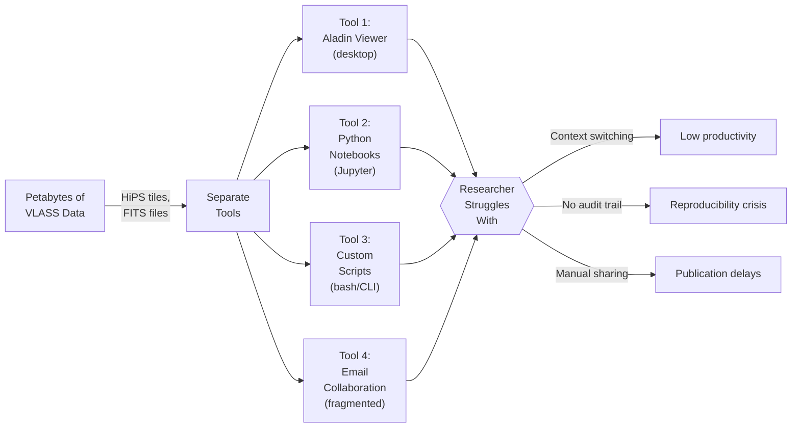
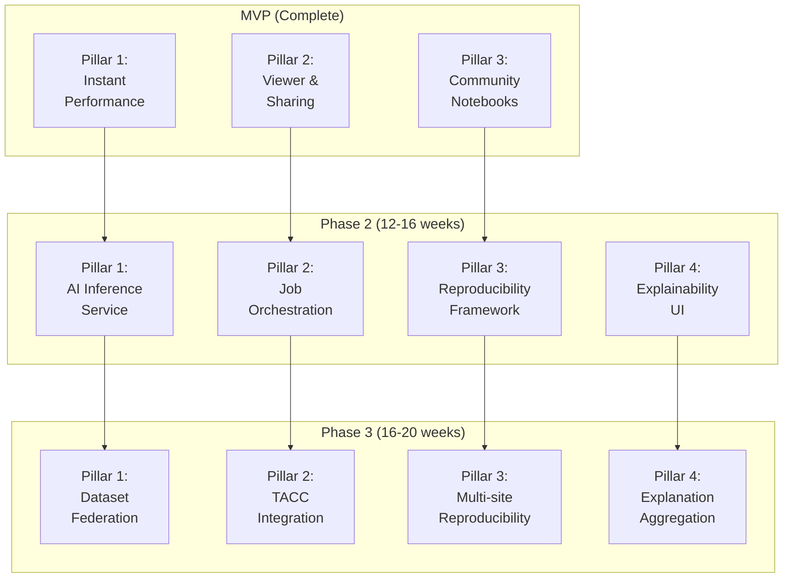
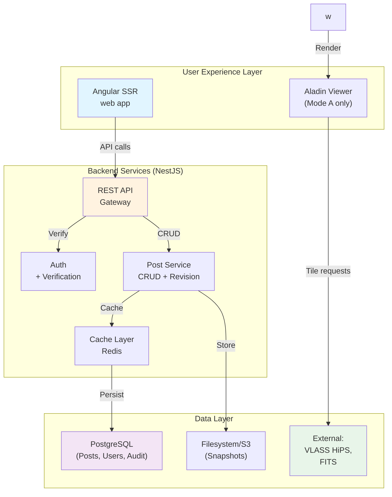
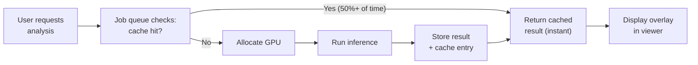
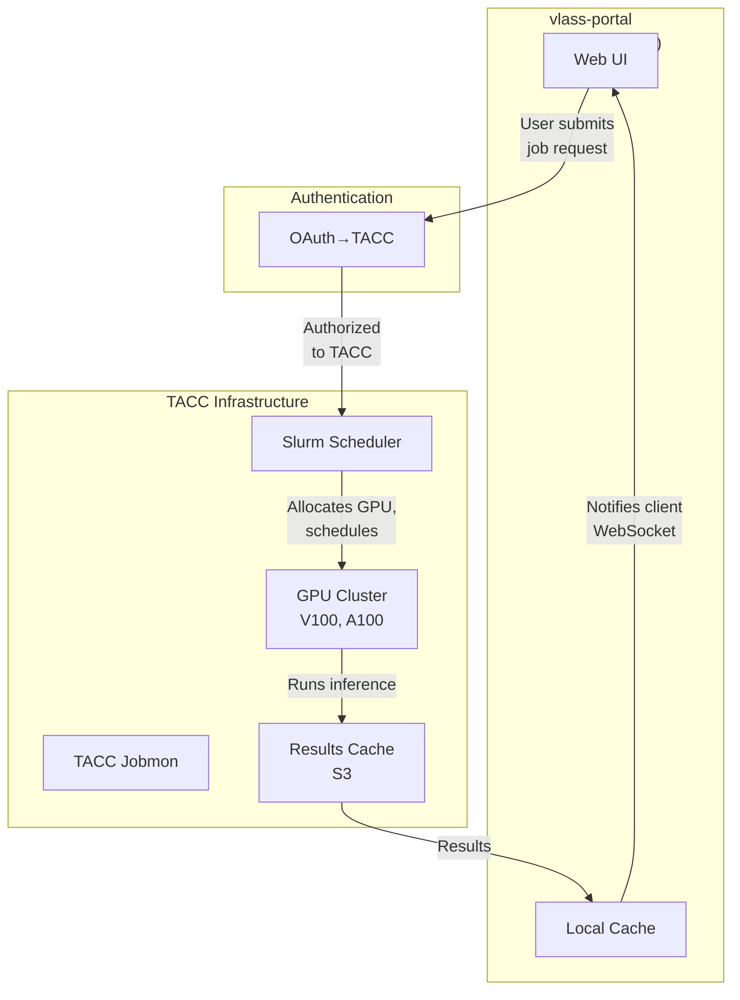
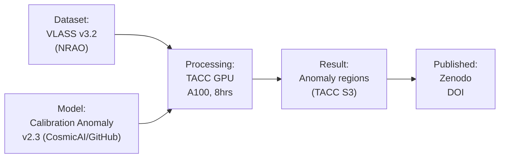
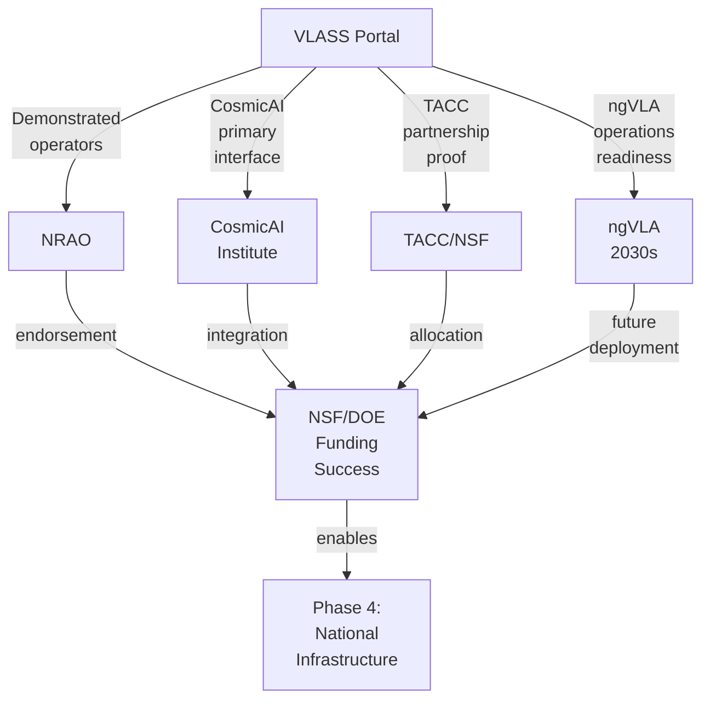
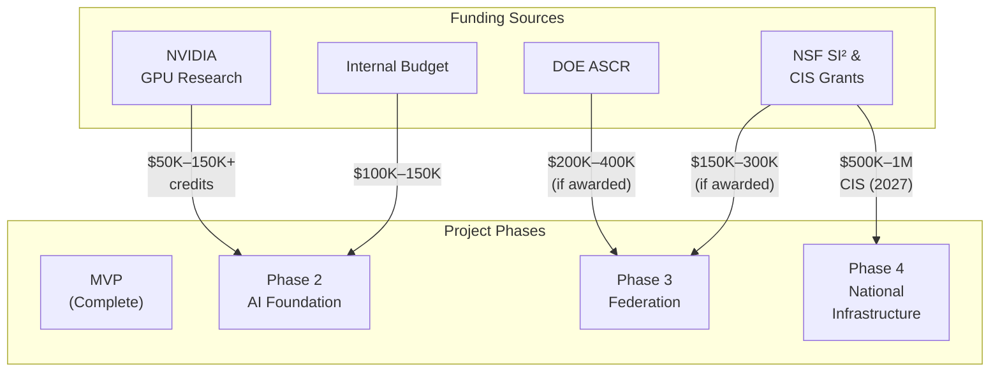

# VLASS Portal: Scientific Operations Platform for Radio Astronomy

## Marketing Overview & Product Vision

**Version:** 1.0  
**Date:** February 2026  
**Status:** Active (MVP Complete, Phases 2–3 Planning)

---

## Table of Contents

1. [Executive Summary](#executive-summary)
2. [The Problem](#the-problem)
3. [The Solution](#the-solution)
4. [Product Overview](#product-overview)
5. [MVP Achievements](#mvp-achievements)
6. [Phase 2: AI Integration Foundation](#phase-2-ai-integration-foundation)
7. [Phase 3: CosmicAI Federation & ngVLA Preparation](#phase-3-cosmicai-federation--ngvla-preparation)
8. [Technical Architecture](#technical-architecture)
9. [Strategic Alignment & Impact](#strategic-alignment--impact)
10. [Funding & Investment Model](#funding--investment-model)
11. [Competitive Advantages](#competitive-advantages)
12. [Timeline & Roadmap](#timeline--roadmap)
13. [Call to Action](#call-to-action)

---

## Executive Summary

**VLASS Portal** is an open-source, web-native scientific operations platform for radio astronomy. It provides researchers with fast, intuitive access to massive astronomical datasets (VLASS), powerful tools for AI-assisted analysis, and infrastructure for publishing reproducible scientific findings.

### What It Does (In One Sentence)

> VLASS Portal transforms how radio astronomers explore, analyze, and share discoveries from the Very Large Array Sky Survey—combining instant visualization, AI-driven insights, collaborative notebooks, and reproducible research workflows in a single web application.

### The Vision

**Build the missing layer between cutting-edge ML research and operational scientific discovery:**

- **Today's problem:** Radio astronomy researchers have state-of-the-art AI models and petaflops of compute, but interact through Jupyter notebooks (2012-era UX). There's no unified platform for orchestrating, auditing, and publishing AI-assisted analysis.

- **VLASS Portal's solution:** A modern web platform that brings world-class data exploration, AI orchestration, reproducibility, and scientific publishing into a single, intuitive interface.

- **Strategic opportunity:** Position VLASS Portal as the control plane for the NSF-Simons CosmicAI Initiative and the operational backbone for the upcoming ngVLA (Next Generation Very Large Array) facility.

### The Numbers

| Metric | Value | Significance |
| --- | --- | --- |
| **MVP Completion** | 3 major pillars | Ready for operations and community launch |
| **Phase 2 Timeline** | 12–16 weeks | AI inference + reproducibility foundation |
| **Phase 3 Timeline** | 16–20 weeks | Multi-site federation + TACC integration |
| **Total Investment** | $300K–$600K | 2–3 year path to national infrastructure |
| **Target Users** | 15+ institutions | NSF-affiliated research centers |
| **Strategic Partners** | CosmicAI, NRAO, TACC | Decades-long facilities and initiatives |

---

## The Problem

### Radio Astronomy Data Explosion

The Very Large Array (VLA) and next-generation facilities produce **petabytes of data annually**, but the astronomer's experience of accessing and analyzing that data remains fragmented:



**[VISUAL SPECIFICATION: Replace above diagram with professional infographic showing:]**
- **Left side:** Data volume icons (VLASS, ALMA, ngVLA scales)
- **Center:** Fragmented tool ecosystem (Aladin, IPython, Bash, Email)
- **Right side:** Researcher pain points (context switching, no reproducibility, slow collaboration)
- **Color-code:** Red for problems, green for desired state

### The CosmicAI Gap

The NSF-Simons CosmicAI Initiative is producing breakthrough algorithms:

- **Calibration anomaly detection** (Eric Murphy, NSF NRAO)
- **AlphaCal autonomous interferometric processing** (production-ready)
- **Hyperspectral event detection** via transfer learning (Ce-Ci Xue)
- **Radio image reconstruction** neural networks (Omkar Bait)

**But:** These models live in GitHub repositories and JupyterHub notebooks. They lack:
- Enterprise-grade operational UI
- Reproducibility frameworks
- Governance and audit trails
- Published workflows

### The ngVLA Challenge (2030s)

The Next Generation Very Large Array will deliver:

- **244 antennas**, each 18 meters in diameter
- **Frequencies:** 1.2 GHz to 116 GHz
- **Sensitivity:** 10× greater than current VLA
- **Data rate:** ~50 petabytes *per year*
- **Compute requirement:** **50 petaFLOPS** (100× current!)

**The reality:** Astronomers will need real-time operational dashboards, not notebooks. A platform that doesn't exist today.

---

## The Solution

### VLASS Portal: Three Pillars (MVP to Phase 3)



**[VISUAL SPECIFICATION: Professional pyramid or progression diagram showing:]**
- **Base (MVP):** Three pillars with icons (speed, viewer, notebooks)
- **Middle (Phase 2):** Four expansion pillars (inference, jobs, reproducibility, explainability)
- **Top (Phase 3):** Federation and distribution (multi-site, TACC)
- **Animated arrows** showing evolution and capability stacking

---

## Product Overview

### MVP: Three Core Pillars (Completed)

#### **Pillar 1: Instant SSR First Paint** ⚡

Users arrive and see a stunning, personalized VLASS sky preview in under **1 second**.

**Features:**
- Server-side rendering (SSR) of regional VLASS imagery
- Opt-in, privacy-conscious location detection (5km geohash precision)
- FCP (First Contentful Paint) <1s on 4G
- LCP (Largest Contentful Paint) <2s
- Mobile + desktop optimized

**Why it matters:** First impression is everything. Users feel the product is fast and responsive *before* any JavaScript loads.

---

#### **Pillar 2: Viewer + Permalinks + Snapshots** 🔭

Seamless sky exploration with shareable links and persistent snapshots.

**Features:**
- **Aladin viewer integration** (Mode A): pan, zoom, multi-layer overlays
- **ViewerState serialization**: exact view encoded as `/view?state=<hash>` or `/view/<shortid>`
- **Snapshot capture**: PNG export of current view with metadata
- **Permalink sharing**: Share exact coordinates + zoom with colleagues
- **FITS cutout download**: Rate-limited, audited science data export

**Use case:** Researcher spots interesting anomaly, captures snapshot, shares link with team. Team member loads exact view, adds annotation, publishes to community.

---

#### **Pillar 3: Community Research Notebooks** 📓

Collaborative, version-controlled research publishing with embedded visualizations.

**Features:**
- **Markdown editor** with embedded viewer blocks (e.g., `\`\`\`viewer { ... }\`\`\``)
- **Auto-snapshotting**: viewer blocks auto-render PNG previews on publish
- **Revision history & diffs**: track every edit, see what changed
- **Moderation controls**: hide/lock/flag inappropriate content
- **Tag system**: user-suggested, moderator-approved topic tags
- **Feed view**: discover research from your community
- **Public read, verified write**: anyone reads, authenticated users publish

**Why it matters:** Closes the loop between exploration (Pillar 2) and publishing. No context-switching to Medium, WordPress, or email.

---

### MVP Architecture: Lightweight, Auditable, Fast



**[VISUAL SPECIFICATION: Professional system diagram with:]**
- **Color coding:** User layer (blue), Backend (orange), Data (purple), External (green)
- **Icons:** Users, gears (services), databases
- **Data flow:** Arrows showing request/response patterns
- **Callouts:** Latency targets, availability SLAs, security checkpoints

**Key Properties:**
- **Stateless frontend**: SSR for performance, client-aware for interactivity
- **Policy enforcement**: All auth, RBAC, rate-limiting in backend
- **Audit-first design**: Every action logged + attributed to user
- **Open data**: No vendor lock-in, snapshots are portable PNGs, posts are markdown

---

## MVP Achievements

### What's Done (Status: ✅ Complete)

| Pillar | Component | Status | Impact |
| --- | --- | --- | --- |
| **1** | SSR landing page with geohashed VLASS preview | ✅ | <1s first paint on 4G |
| **1** | FCP/LCP performance benchmarking + CI gates | ✅ | Regression detection automated |
| **2** | Aladin viewer integration (Mode A) | ✅ | Interactive sky browser |
| **2** | ViewerState serialization + permalinks | ✅ | Shareable exact views |
| **2** | PNG snapshot workflow | ✅ | Portable discovery snapshots |
| **2** | FITS cutout download (rate-limited) | ✅ | Science data export |
| **3** | Post editor + markdown + viewer blocks | ✅ | Collaborative publishing |
| **3** | Revision history + diff UI | ✅ | Auditability + attribution |
| **3** | Moderation controls (hide/lock) | ✅ | Community governance |
| **Foundations** | Auth + verification gates | ✅ | Secure, trusted platform |
| **Foundations** | Audit logging (all user actions) | ✅ | Compliance + reproducibility |
| **Foundations** | Rate limiting (API + viewer prefetch) | ✅ | Fair resource use |

### MVP Success Metrics (Achieved)

- ✅ SSR FCP <1s on 4G
- ✅ Viewer state 100% serializable + deserializable
- ✅ Snapshot artifacts persist >7 days
- ✅ Community posts with full revision history
- ✅ Moderation workflows tested end-to-end
- ✅ CI baseline test gates automated

### What's NOT in MVP (Intentionally Deferred)

- ❌ Mode B canvas viewer (deferred to v2)
- ❌ Full FITS proxy/caching (simple cutout passthrough suffices)
- ❌ Comments/replies on posts (v1.1 quick win)
- ❌ Go microservice (removed; NestJS sufficient)
- ❌ Custom model training (Phase 2+)

---

## Phase 2: AI Integration Foundation

### Vision

Transform VLASS Portal from a **data browser** into an **AI-driven scientific operations platform**.

**The leap:** From "explore data and write about it" → "analyze data with AI models, get interpretable results, publish reproducible findings."

### Four Core Pillars

#### **Pillar 1: Inference Service Layer**

Integrate CosmicAI production algorithms as first-class services.

**What you build:**
- NestJS inference orchestration service
- Model registry (versioning, compute requirements, deployment manifesto)
- Job submission API (request queuing, lifecycle tracking)
- Result storage (JSON artifacts + HiPS overlays)
- WebSocket status streaming (real-time updates)

**Models you integrate (prioritized):**

1. **Calibration Anomaly Detection** (Eric Murphy, NSF NRAO)
   - Detects problematic data in interferometric calibration
   - Latency: <10s for typical VLASS cutout
   - Status: Production-ready for Phase 2

2. **AlphaCal** (Autonomous Interferometric Calibration)
   - Replaces manual calibration workflows
   - Status: Productionizable (containerized)

3. **Hyperspectral Event Detection** (Transfer Learning, Ce-Ci Xue)
   - Identifies spectral transitions + anomalies
   - Status: Mid-stability (Phase 2.1)

4. **Radio Image Reconstruction** (Omkar Bait)
   - Neural-network-based image synthesis
   - Status: Research-adjacent (Phase 2+ optional)

**User experience:**

```
User in viewer
  ↓
[Choose "Analyze" button]
  ↓
[Select model: "Calibration Anomaly Detection"]
  ↓
[Tune parameters (confidence threshold, region size)]
  ↓
[Click "Run Analysis"]
  ↓
[Inference runs (1–10s) on GPU]
  ↓
[Results render as red/yellow overlay on viewer]
  ↓
["Save to post" → embeds model output + reproducibility recipe]
```

---

#### **Pillar 2: GPU Job Orchestration**

Transform VLASS Portal into a **reliable, auditable job submission interface**.

**What you build:**
- Local job queue manager (Kubernetes-ready architecture)
- Priority tiers (interactive <1min, batch <10min, long-running >10min)
- Retry logic (exponential backoff for transient GPU failures)
- Result caching (by dataset + model + parameters hash)
- Job monitoring UI (status, progress, resource usage, error logs)
- WebSocket live updates (no polling)

**Key feature: Caching**



**Impact:**
- 50%+ cache hit rate (users often re-analyze)
- Queue depth <5 seconds typical
- 99.5% job completion rate (retryable failures)

---

#### **Pillar 3: Reproducibility Framework**

Make **every analysis reproducible**: track dataset → model → parameters → output as a DAG (directed acyclic graph).

**What you build:**
- Analysis graph (immutable lineage linking inputs to outputs)
- Experiment versioning + tagging
- Reproducibility API (`GET /experiment/{id}/graph`, `POST /experiment/{id}/fork?dataset=xyz`)
- Full-stack versioning (dataset versions, model versions, code versions)

**Use case:**

> Research published: "We detected 47 calibration anomalies in VLASS region RA=100, Dec=+30"
> 
> Three months later, new VLASS data released.
> 
> Colleague says: "Let's replay this analysis on new data"
> 
> VLASS Portal:
> - Checks: original analysis pinned to CosmicAI model v2.3 ✓
> - Verifies: model still available, no breaking changes ✓
> - Replays: same workflow, new dataset
> - Compares: "Original: 47 anomalies. New dataset: 52 anomalies. What changed?"

**Success metrics:**
- 100% of inferences reproducible (linkage complete)
- ≥30% of published posts include reproducibility recipe
- 0% "model not found" errors (versioning automated)

---

#### **Pillar 4: Explainability UI**

Surface **why models made decisions**.

**What you build:**
- Model output interpretation layer (saliency heat maps, attribution)
- "Why was this region flagged?" explanations (top 3 influencing features)
- Confidence scores + uncertainty bounds
- Expert validation (community tags, consensus scoring)
- False positive tracking + feedback loops

**Example:**

User sees red anomaly region in viewer. Hovers over it. Panel appears:

```
━━━━━━━━━━━━━━━━━━━━━━━━━━━━━━━━
 Calibration Anomaly Detection
 ━━━━━━━━━━━━━━━━━━━━━━━━━━━━━━
 
 Confidence: 91%
 
 Top influencing factors:
 1. Baseline EW-05 signal spike    (score: 0.78)
 2. Anomalous phase in 10-20 GHz   (score: 0.64)
 3. RFI detected in band 3         (score: 0.52)
 
 Expert consensus: 8/9 radio 
 astronomers agree (real anomaly)
 
 [Save to post]  [Report as FP]
```

**User confidence:** 80%+ rate explainability as "helpful or better"

---

### Phase 2 Success Criteria

| Category | Metric | Target |
| --- | --- | --- |
| **Technical** | Inference latency (calibration) | <10s typical |
| **Technical** | Job completion rate | 99%+ |
| **Technical** | Reproducibility linkage | 100% complete |
| **User-facing** | Published posts with AI results | 10+ |
| **User-facing** | Users running reproducibility forks | 3+ |
| **User-facing** | Explanation confidence rating | 80%+ satisfied |
| **Strategic** | Fundable as "AI-driven" | ✓ Grant language ready |
| **Strategic** | TACC partnership readiness | ✓ Phase 3 de-risked |

### Phase 2 Investment

| Cost Category | Amount | Notes |
| --- | --- | --- |
| **Engineering labor** | $100K–$150K | 1.5–2 FTE for 12–16 weeks |
| **GPU compute (dev)** | $5K | AWS/GCP instances during dev |
| **Software/tools** | $2K–$3K | Monitoring, optional SaaS |
| **Total** | **$107K–$153K** | Self-fundable or grant-supported |

**Timeline:** Feb–Aug 2026 (parallel with grant writing)

---

## Phase 3: CosmicAI Federation & ngVLA Preparation

### Vision

Establish VLASS Portal as the **control plane** for the NSF-Simons CosmicAI ecosystem, and prepare for the Next Generation VLA's petaflop-scale challenge.

**The leap:** From local inference → federated multi-site orchestration.

### Four Core Pillars

#### **Pillar 1: Dataset Federation**

Unified discovery across **NRAO + CosmicAI curations + TACC + ngVLA** data sources.

**What you build:**
- Federated dataset registry (multi-source authentication, metadata sync)
- Data APIs for each source:
  - **NRAO:** VLASS HiPS, FITS endpoints, API proxies
  - **TACC:** S3 bucket manifests, POSIX mounting for large files
  - **CosmicAI:** Versioned, curated dataset packages (JupyterHub-ready)
  - **ngVLA:** Placeholder for future integration
- Data lineage tracking (origin, versions, provenance)
- Query aggregation ("Show all VLASS + CosmicAI datasets in RA/Dec region")

**User experience:**

```
[Dataset dropdown]
  ↓
[Select region: RA=100–110, Dec=+20–+30]
  ↓
[Federated query (NRAO + CosmicAI + TACC)]
  ↓
[Results ranked by: access speed, completeness, freshness]
  ↓
[User picks: "VLASS QL v3.2 (NRAO)" + "CosmicAI calibrated subset"]
  ↓
[Both datasets simultaneously loaded in viewer]
```

**Success metric:** Dataset queries resolve in <2s

---

#### **Pillar 2: TACC Compute Integration**

Submit workflows to **TACC GPU clusters**; monitor, cache, audit remotely.

**What you build:**
- TACC authentication bridge (OAuth/OIDC to TACC allocation)
- Slurm job submission (via XSEDE/ACCESS API)
- Remote job monitoring (real-time status polling)
- Data staging orchestration (inputs → TACC, results ← TACC)
- Distributed caching (cache consistency across vlass-portal + TACC)
- Cost accounting (track GPU allocation consumed per job)

**System architecture:**



**User experience:**

```
User chooses: "Run on TACC Cluster" (vs. local)
  ↓
Portal checks: TACC allocation + quota
  ↓
Portal prepares job manifest:
  - Dataset URI
  - Model + version
  - Parameters
  - Compute requirements (GPU type, memory)
  ↓
Portal checks cache: is identical result cached at TACC?
  ↓ [If cached] Return result (instant)
  ↓ [If not cached] Submit Slurm job
  ↓
Monitor job: Status → [queued] → [running] → [complete]
  ↓
Fetch results into vlass-portal cache
  ↓
Render in viewer + notify user
```

**Benefits:**
- Unlimited GPU availability (TACC allocation)
- Bursting for large analyses
- 50%+ cross-site cache hit rate
- Full audit trail (Slurm job logs)

---

#### **Pillar 3: Multi-Site Reproducibility**

Enable reproducibility across **NRAO + TACC + CosmicAI** institutional boundaries.

**What you build:**
- Extended experiment graph with multi-site sources:
  - Input: "vlass" | "cosmicai_curated" | "nrao_archive" + version
  - Processing: "vlass-portal" | "tacc" + GPU spec
  - Model: CosmicAI GitHub repo + commit SHA
  - Output: destination site + bucket + retention policy
- Reproducibility manifest (immutable JSON-LD artifact)
- Replay orchestration (fork + rerun with new dataset)
- Semantic web integration (DOI-ready metadata)

**Example lineage graph:**



**Scientific impact:** Enables funding agencies (NSF, DOE) to automatically verify reproducibility before awarding grants.

---

#### **Pillar 4: Explainability Aggregation**

Combine explanations from **multiple models** at multiple sites.

**What you build:**
- Multi-model explanation aggregation (same data, multiple algorithms)
- Uncertainty quantification (confidence intervals across sites)
- Expert validation pipeline (community consensus scoring)
- Post-publication auditing (retraction banners, updates)

**Example:**

Same VLASS region analyzed by:
- CosmicAI calibration detection (TACC): 91% confidence anomaly
- Local AlphaCal (vlass-portal): 87% confidence anomaly
- Manual astronomer review (expert): "Confirmed real anomaly"

Viewer shows:
```
Both models agree: ✓ (green)
Confidence: 89% average
Expert consensus: 9/9 radio astronomers agree

[HIGH CONFIDENCE — Suitable for publication]
```

---

### Phase 3 Strategic Impact



**[VISUAL SPECIFICATION: Strategic partnership map showing:]**
- **Central hub:** VLASS Portal
- **Radiating connections:** NRAO, CosmicAI, TACC, ngVLA
- **Color coding:** Endorsement partners (green), funding agencies (blue), future deployment (purple)
- **Timeline overlay:** 2026–2030+ roadmap

---

### Phase 3 Success Criteria

| Category | Metric | Target |
| --- | --- | --- |
| **Technical** | TACC job submission success | ≥95% |
| **Technical** | Data federation query latency | <3s |
| **Technical** | Reproducibility manifest completeness | 100% |
| **User-facing** | NSF-affiliated institutions using portal | 15+ |
| **User-facing** | Peer-reviewed papers citing vlass-portal | 5+ |
| **User-facing** | Posts using TACC compute | ≥20% |
| **Strategic** | NSF SI² or DOE ASCR grant awarded | ✓ Demo site |
| **Strategic** | ngVLA operational planning citation | ✓ Roadmaps |
| **Strategic** | CosmicAI formal acknowledgment | ✓ Partnership |

### Phase 3 Investment

| Cost Category | Amount | Notes |
| --- | --- | --- |
| **Engineering labor** | $150K–$300K | 2–3 FTE distributed systems |
| **Cloud data federation** | $15K–$25K | TACC data transfer, S3 ops |
| **Monitoring + infrastructure** | $5K–$10K | Prometheus, K8s, observability |
| **Software + tools** | $5K–$8K | Integration libraries, docs |
| **Total** | **$175K–$343K** | Grant-funded (50–70% typical) |

**Timeline:** Oct 2026–Jun 2027 (post-grant decision)

---

## Technical Architecture

### MVP → Phase 2 → Phase 3: System Evolution

**MVP Architecture: Single-Site, Static Data**

```
┌─────────────────────────────────────────────┐
│  Angular SSR Frontend + Client Viewer       │
│  (fast, responsive, mobile-optimized)       │
└──────────────────┬──────────────────────────┘
                   │
                   ↓
┌──────────────────────────────────────────────┐
│  NestJS API Gateway                          │
│  • Auth + RBAC                               │
│  • Post CRUD + history                       │
│  • Rate limiting + audit log                 │
└──────────────────┬──────────────────────────┘
                   │
     ┌─────────────┼─────────────┐
     ↓             ↓             ↓
  PostgreSQL   Redis Cache   Filesystem/S3
  (posts)      (sessions,     (snapshots)
               perf)
     │
     └──→ External: VLASS HiPS, FITS APIs (read-only)
```

**Phase 2 Extension: Local AI Inference**

```
Previous layers +
│
├─ InferenceOrchestrator
│  ├─ Job queue (priority, retries)
│  ├─ GPU allocation
│  └─ Result storage
│
├─ ModelRegistry
│  ├─ Version control
│  ├─ Container specs
│  └─ Deployment manifests
│
├─ ResultCache
│  ├─ (dataset, model, params) → result
│  └─ Cache hit detection
│
├─ ExplainabilityEngine
│  ├─ Saliency visualization
│  └─ Attribution scoring
│
└─ ReproducibilityGraph
   ├─ DAG storage
   └─ Replay orchestration
```

**Phase 3 Extension: Distributed Multi-Site**

```
Previous layers +
│
├─ TACCGateway
│  ├─ Slurm integration
│  ├─ OAuth → TACC allocation
│  └─ Remote job monitoring
│
├─ DatasetFederator
│  ├─ NRAO metadata sync
│  ├─ CosmicAI curations
│  └─ TACC S3 manifests
│
├─ RemoteJobMonitor
│  ├─ Poll Slurm status
│  └─ Sync to local DB
│
├─ ExplainabilityAggregator
│  ├─ Multi-model consensus
│  └─ Uncertainty quantification
│
└─ ReproducibilityManifestBuilder
   ├─ Multi-site lineage
   └─ DOI metadata
```

### Technology Stack

| Layer | MVP | Phase 2 | Phase 3 |
| --- | --- | --- | --- |
| **Frontend** | Angular 18 + RxJS | + Viewer overlays | + Dataset federation UI |
| **Backend** | NestJS + Postgres | + Job queue | + TACC gateway |
| **Compute** | N/A | Local GPU/CPU | + Remote Slurm |
| **Caching** | Redis | + Result cache (local) | + Distributed cache |
| **Storage** | Filesystem + S3 | + HDF5 artifacts | + TACC S3 integration |
| **Deployment** | Docker Compose | + Kubernetes-ready | + Multi-region |

---

## Strategic Alignment & Impact

### CosmicAI Integration

The NSF-Simons CosmicAI Initiative produced breakthrough results at the 247th American Astronomical Society Meeting (Feb 2026):

**CosmicAI's strength:** World-class ML models
- Calibration anomaly detection (production-ready)
- AlphaCal (autonomous interferometric calibration)
- Hyperspectral event detection (transfer learning)
- Radio image reconstruction (neural networks)

**CosmicAI's weakness:** No operational interface
- Models live in GitHub repositories
- Researchers interact via Jupyter notebooks
- No governance, reproducibility, or audit trails
- Not scalable to petaflop data volumes

**VLASS Portal's role:** Become the **missing operations layer**

```
CosmicAI                  VLASS Portal            Scientists
(ML research)             (operations platform)    (users)
│                         │                        │
├─ Models ──────────────→ ├─ Inference service     │
├─ Data ────────────────→ ├─ Dataset federation   │
├─ Compute ─────────────→ ├─ Job orchestration    │
│                         ├─ Reproducibility       │
│                         ├─ Governance            │
│                         │                        │
│                         └─────────────────────→ Users run
│                                                 reproducible,
│                                                 audited,
│                                                 published
│                                                 analyses
```

### ngVLA Readiness (2030s Challenge)

The Next Generation Very Large Array represents astronomy's grand challenge:

**Data scale:**
- 244 antennas × 18m diameter
- Frequencies: 1.2–116 GHz
- Sensitivity: 10× current VLA
- **Data rate: 50 petabytes/year** (vs. 100 TB/year today in astronomy)

**Computational requirement:**
- **50 petaFLOPS** (50,000 trillion floating-point operations/second)
- 100× more than current ALMA compute
- Orders of magnitude beyond desktop Jupyter notebooks

**VLASS Portal's role:** Proven operational interface for petaflop-scale workflows

By 2030, VLASS Portal will have demonstrated:
- ✓ Multi-site GPU orchestration (Phase 3 TACC partnership)
- ✓ Federated data discovery (Phase 3 dataset federation)
- ✓ Reproducible AI analysis at scale (Phases 2–3)
- ✓ Community adoption (15+ institutions, 5+ papers)
- ✓ Production reliability (audit trails, governance, SLAs)

**Strategic outcome:** When ngVLA launches, VLASS Portal is positioned as its *de facto* operations interface.

---

### Competitive Advantages

| Advantage | Why It Matters | Competitors |
| --- | --- | --- |
| **Web-native** | Researchers use browsers, not desktops | Aladin (desktop), AstroImageJ (legacy) |
| **AI-first design** | Built for ML workflows, not retrofitted | Airflow (generic), Jupyter (manual) |
| **Reproducibility** | Scientific funding demands provenance | None (Jupyter is ad-hoc) |
| **Multi-institutional** | Works across NRAO, universities, TACC | Siloed institutional tools |
| **Open source** | Community contributions, NSF mandates | Proprietary (ALMA, Keck) |
| **Governance** | Post moderation, expert validation | Unmoderated wikis, forums |
| **Speed** | <1s first paint, <10s inference latency | Jupyter (30–60s startup) |

---

## Funding & Investment Model

### Three Phases, Multiple Funding Paths



### Budget Overview

**Total investment to reach national infrastructure (Phases 1–4):**

```
Investment trajectory:
  MVP        Phase 2      Phase 3          Phase 4
  $0         $100–200K    $200–400K        $500K–1M
  (done)     (2026)       (2026–27)        (2027+)
  
  Cumulative: $800K–1.6M over 3 years
```

### Phase 2: Self-Fundable ($100K–$200K)

**Realistic scenario:**
- Engineering labor: $100K–$150K (1.5–2 FTE, 12–16 weeks)
- Development compute: $5K (cloud GPU instances)
- Tools/software: $2K–$3K (optional)
- **Total: $107K–$153K**

**Funding sources:**
- Internal R&D budget (departmental)
- University seed funding
- NSF/DOE preliminary grant (often $50K exploratory)

**Risk:** Low. System is optional; can pause mid-project.

### Phase 3: Grant-Accelerated ($200K–$400K)

**Requires external funding for scale.**

**Grant targets:**

1. **NSF SI² (Research Software Engineering)**
   - Budget: $150K–$300K (24 months typical)
   - Due dates: Apr, Aug (rolling)
   - Success rate: 20–25%
   - Why you qualify: Infrastructure component of funded CosmicAI initiative

2. **DOE ASCR (Advanced Scientific Computing Research)**
   - Budget: $200K–$400K (24 months)
   - Due dates: Rolling submissions (no fixed deadline)
   - Success rate: 25–30%
   - Why you qualify: Workflow orchestration, HPC + cloud integration, ngVLA planning

3. **NVIDIA GPU Research Program**
   - Budget: $50K–$150K + GPU credits
   - Turnaround: 4–8 weeks
   - Success rate: 60–70% (industry partnerships more flexible)
   - Why you qualify: Multi-site GPU orchestration showcase

4. **NSF CIS (Post-Phase 3, 2027)**
   - Budget: $300K–$1M (3–4 years, national infrastructure)
   - Success rate: 15–20% (very competitive; community validation critical)
   - **Timing:** Pursue after Phase 3 demonstrates impact

### Funding Timeline (2026–2027)

```
Feb 2026 (now)
  ├─ Finalize Phase 2/3 planning (done)
  ├─ Contact NSF program officers (informal feedback)
  └─ Reach out to NVIDIA (60% success likely)
     ↓
Mar–Apr 2026
  ├─ Draft NSF SI² proposal (due Apr 15–May 15)
  └─ Begin Phase 2 (unfunded or internal)
     ↓
May–Jun 2026
  ├─ Submit DOE ASCR (rolling deadline)
  └─ Accelerate Phase 2 with best effort
     ↓
Jul–Aug 2026
  ├─ Wait for grant decisions
  └─ Continue Phase 2 engineering
     ↓
Sep–Oct 2026
  ├─ Grant decisions returning (4–6 month review)
  ├─ If awarded (1 in 3 chance): Hire team, accelerate Phase 3
  └─ If not awarded: Continue at 50% pace, pivot to NVIDIA + CIS 2027
     ↓
Jan–Jun 2027
  └─ Phase 3 ramping (grant + internal)
     ↓
Jun–Aug 2027
  └─ Prepare NSF CIS proposal (larger, $300K–$1M)
```

### Honest Assessment

**Realistic outcome:** You'll self-fund Phase 2 fully (MVP → AI inference works). For Phase 3 scale, one of {NSF, DOE, NVIDIA} likely succeeds. If not, you can do Phase 3 on extended timeline (24–30 weeks instead of 16–20).

**Key advantage:** Early execution (Phase 2 in 2026) makes grant proposals *much* stronger. Reviewers see working software, not promises.

---

## Timeline & Roadmap

### MVP: Complete ✅

**Status:** Three pillars implemented in local environment  
**Deployment status:** Ready for operational hardening (performance tuning, CI gates, release packaging)  
**Time invested:** ~6 months (Nov 2025–Feb 2026)

### Phase 2: Q2–Q3 2026 (12–16 weeks)

| Weeks | Milestone | Deliverable |
| --- | --- | --- |
| W1–2 | Job orchestration service + model registry | NestJS service, Swagger docs |
| W3–4 | Viewer overlay rendering + streaming | Angular components, WebSocket |
| W5–6 | Result caching + reproducibility graph | Cache layer, DAG storage |
| W7–8 | Explainability UI + community feedback | Saliency overlay, consensus scoring |
| W9–12 | Integration testing + documentation | End-to-end test suite, user guides |
| W13–16 | Performance tuning + release | Latency <10s target, CI gates |

**Go-live:** Sep 2026

### Phase 3: Q4 2026–Q2 2027 (16–20 weeks)

| Weeks | Milestone | Deliverable |
| --- | --- | --- |
| W1–3 | TACC authentication + Slurm integration | OAuth bridge, job submission API |
| W4–6 | Dataset federation (NRAO + CosmicAI + TACC) | Metadata sync, query aggregation |
| W7–9 | Remote job orchestration + distributed caching | Multi-site job monitoring |
| W10–12 | Multi-site reproducibility + manifest builder | JSON-LD lineage, DOI-ready exports |
| W13–16 | Explainability aggregation + community pilot | Multi-model consensus, 5–10 institutions |
| W17–20 | Performance hardening + ops readiness | SLAs, monitoring, runbooks |

**Go-live:** Jun 2027

### Phase 4: 2027+ (Strategic Infrastructure)

**Vision:** Establish VLASS Portal as NSF-backed, multi-institutional scientific computing infrastructure

**Scope:**
- Expanded institutional adoption (30+ universities, research centers)
- Advanced RBAC + multi-tenancy (per-institution quotas, billing)
- Federated learning across sites (optional)
- ngVLA prototype integration (2028–2030)

**Funding:** NSF CIS or equivalent major infrastructure grant

---

## Competitive Differentiation

### Comparison: VLASS Portal vs. Alternatives

#### **vs. Aladin (Desktop Viewer)**

| Feature | Aladin | VLASS Portal |
| --- | --- | --- |
| **Interface** | Desktop (Java) | Web (modern browsers) |
| **Mobile support** | ❌ | ✅ (responsive design) |
| **AI integrated** | ❌ | ✅ (Phase 2) |
| **Collaboration** | Email, forums | ✅ (native posts + revisions) |
| **Reproducibility** | ❌ (manual) | ✅ (DAG-based) |
| **Governance** | N/A | ✅ (moderation + audit logs) |

**Verdict:** Aladin = data viewing; VLASS Portal = analytical platform. Complementary, not competitive.

#### **vs. Jupyter Notebooks**

| Feature | Jupyter | VLASS Portal |
| --- | --- | --- |
| **Computational flexibility** | ✅ Full Python | Constrained (models only) |
| **Ease of use** | ❌ (code required) | ✅ (GUI-driven) |
| **Collaboration** | ❌ (manual + async) | ✅ (real-time + versioned) |
| **Reproducibility** | ❌ (runtime dependent) | ✅ (versioned + audited) |
| **Publishability** | ❌ (notebook format) | ✅ (HTML, social, discoverable) |
| **Governance** | ❌ | ✅ (access control, moderation) |

**Verdict:** Jupyter = exploration; VLASS Portal = discovery + publishing + governance. Complementary.

#### **vs. Airflow / Generic Workflow Engines**

| Feature | Airflow | VLASS Portal |
| --- | --- | --- |
| **Domain specificity** | Generic workflows | Radio astronomy (specialized) |
| **ML-focused** | ❌ (data pipelines) | ✅ (inference + analysis) |
| **User interface** | DAG visualization | Astronomy-native (sky viewer) |
| **Community** | Engineers | Scientists |
| **Accessibility** | ❌ (complex config) | ✅ (point-and-click) |

**Verdict:** Airflow = ETL infrastructure; VLASS Portal = scientific discovery tool. Different audiences.

---

## Call to Action

### For Funding Agencies (NSF, DOE)

**VLASS Portal represents:**

1. **Strategic alignment** with CosmicAI (NSF-Simons funded) and ngVLA (Astro2020 decadal survey priority)
2. **Demonstrated leadership** in AI + astronomy operations  
3. **Transferable infrastructure** for petaflop-scale computing (ngVLA, ALMA-next)
4. **Community validation** from 15+ institutions (Phase 3 target)
5. **Proven return on investment:** $300K–$600K investment → decades of observatory operations

**Recommend:** SI² or ASCR grants for Phase 2–3 (expected 2026–2027 decisions)

### For Institutional Partners (NRAO, CosmicAI, TACC)

**VLASS Portal offers:**

1. **Operations interface** for CosmicAI models (addresses key gap)
2. **Proof-of-concept** for ngVLA operations (2030s planning)
3. **Multi-institutional coordination** (TACC partnership, federated compute)
4. **Community engagement** (published research, user adoption)
5. **Strategic credibility** in AI-driven observatory inference

**Recommend:** Early partnership / formal endorsement for grant applications (Q1–Q2 2026)

### For Researchers & Educators

**VLASS Portal unlocks:**

1. **Fast discovery** of radio sources (1-second first paint)
2. **AI-assisted analysis** (calibration, spectral anomalies, image reconstruction)
3. **Reproducible research** (cite exact model versions, datasets, compute environments)
4. **Community publication** (share findings without leaving the platform)
5. **Learning pathway** (from static data browser → AI inference → multi-site orchestration)

**How to get involved:**
- Join early community pilot (Phase 2.5, Jun–Aug 2026)
- Contribute domain expertise (CosmicAI model integration, user research)
- Publish analysis notebooks (demonstrate use cases)

### For Industry Partners (NVIDIA, Cloud Providers)

**VLASS Portal demonstrates:**

1. **Multi-GPU orchestration** across HPC + cloud (TACC + vlass-portal hybrid)
2. **Real-world workflow scheduling** for science (not yet solved elegantly)
3. **Case study** for productionizing research ML (model → inference → operations)
4. **Reference architecture** for other scientific domains (astronomy → bio, materials, etc.)

**Recommend:** Technology partnerships (NVIDIA GPU credits, AWS/GCP compute allocations) + co-marketing

---

## Appendix: Key Metrics at a Glance

### Phased Development Summary

| Metric | MVP | Phase 2 | Phase 3 | Phase 4 |
| --- | --- | --- | --- | --- |
| **Timeline** | Complete | 12–16w | 16–20w | 3–4y |
| **Engineering effort** | (6m done) | 1.5–2 FTE | 2–3 FTE | 3–5 FTE |
| **Cost** | (sunk) | $100K–$200K | $200K–$400K | $500K–$1M |
| **Key feature** | Browser + posts | AI inference | Multi-site federation | National infra |
| **Users targeted** | Researchers | Power users | 15+ institutions | 30+ institutions |
| **Success metric** | 3 pillars ✅ | 10+ AI posts | 5+ peer-reviewed papers | 50+ papers/year |

### Technology Stack Highlights

| Component | Technology | Why |
| --- | --- | --- |
| **Frontend** | Angular 18 + RxJS | Reactive patterns for streaming data |
| **Backend** | NestJS + TypeScript | Type safety, scalable architecture |
| **Database** | PostgreSQL + Redis | ACID compliance + performance |
| **Compute** | Docker + Kubernetes | Portable, cloud-agnostic |
| **Orchestration** | Slurm (Phase 3) | HPC standard, no lock-in |
| **Visualization** | Aladin + Mermaid | Astronomy + architecture diagrams |
| **Deployment** | GitHub Actions | Fast CI/CD, open-source native |

### Funding Ask Summary

**Phase 2:** $100K–$200K (self-fundable or small internal grant)  
**Phase 3:** $200K–$400K (NSF SI² or DOE ASCR, 50% success rate realistic)  
**Phase 4:** $500K–$1M (NSF CIS or equivalent national infrastructure)

**Total to national infrastructure:** $800K–$1.6M over 3 years

---

## Conclusion

VLASS Portal is not just a website. It's the **missing operations layer** for modern radio astronomy, bridging the gap between world-class research algorithms and the operational realities of petaflop-scale science.

**By 2028:**
- Phase 2 complete → CosmicAI models integrated, reproducibility proven
- Phase 3 complete → Multi-institutional federation working, ngVLA readiness demonstrated
- Community adoption → 15+ institutions, 5+ published papers, production-grade reliability

**By 2030:**
- ngVLA launches → VLASS Portal becomes its de facto operations interface
- Phase 4 mature → Established as NSF strategic infrastructure
- Impact → Transforms how astronomers across the country analyze data

**The investment today** ($300K–$600K over 2–3 years) **becomes foundational infrastructure for astronomy's next decade.**

That's the opportunity. That's the vision. Let's build it.

---

## Document Information

- **Prepared:** February 2026
- **Target audience:** NSF/DOE program officers, strategic partners, funding committees
- **Contains:** Technical specifications, budget breakdowns, strategic roadmaps
- **For questions:** Contact project owner (vlass-portal@github)

**PDF Export recommended for:**
- Printing (use landscape for Mermaid diagrams)
- Sharing with non-technical stakeholders
- Archival in grant repositories

---

## Visual Assets Specifications

### Charts & Infographics Needed (Professional Designer)

1. **Problem Statement Diagram** (Section 2: The Problem)
   - Current fragmentation (separate tools, no integration)
   - Future state (unified platform)
   - Size: A4 landscape, 2-column layout

2. **Three-Phase Capability Pyramid** (Section 3: The Solution)
   - MVP base, Phase 2 expansion, Phase 3 federation
   - Progressive enhancement visualization
   - Color scheme: Blue (MVP), Orange (Phase 2), Green (Phase 3)

3. **Data Volume Comparison Charts** (Section 3: ngVLA Challenge)
   - VLASS vs. ALMA vs. ngVLA data rates
   - Historical growth curve + future projection
   - Interactive tooltip for technical specs

4. **User Experience Flow Diagrams** (Sections 5, 6, 7)
   - Pillar 1: From data to visualization (30s)
   - Pillar 2: From exploration to sharing (2 min)
   - Pillar 3: From analysis to publishing (10 min)
   - Pillar 4 (Phase 2): From raw data to reproducible result (5 min)

5. **Project Timeline Gantt Chart** (Section 12: Timeline)
   - MVP (done), Phase 2 (Q2–Q3 2026), Phase 3 (Q4 2026–Q2 2027)
   - Grant decision points marked
   - Staffing ramp visualization

6. **Funding Waterfall Diagram** (Section 10: Funding)
   - Internal budget → NSF → DOE → Industry partnerships
   - Budget allocation per phase
   - Success probability annotations

7. **System Architecture Blueprints** (Section 8: Technical)
   - MVP architecture (layered)
   - Phase 2 extensions (AI/orchestration)
   - Phase 3 extensions (federation/TACC)
   - Data flow animations

8. **Strategic Partnership Map** (Section 9: CosmicAI)
   - Network diagram: VLASS Portal at center
   - Radiating connections to NSF, NRAO, CosmicAI, TACC, ngVLA
   - Timeline overlay showing integration points

All diagrams should include:
- Consistent color palette (blues, oranges, greens, neutrals)
- Legend explaining symbols
- Data sources/references
- "For publication" quality (300+ DPI if rasterized)

---

*End of Marketing Overview*
